# Kiến trúc kỹ thuật Network Encryptor

Tài liệu này mô tả code thực tế trên nhánh `main`, commit `edec31f`. Mục tiêu là giải thích hệ thống chạy như thế nào, lý do của từng tầng thuật toán, đường đi và quyền sở hữu của gói tin, cùng vai trò của từng file/nhóm hàm. Những mục ghi **Cảnh báo hiện trạng** là khoảng cách giữa thiết kế mong muốn và code đang có; không được hiểu đó là tính năng đã hoàn thiện.

## 1. Hệ thống giải quyết bài toán gì

Network Encryptor là dataplane Layer 2 chạy native XDP/AF_XDP ở chế độ copy, dùng nhiều WAN đồng thời cho từng connection. Gói IPv4/ARP được đưa khỏi kernel vào userspace, được phân loại policy, mã hóa AES-GCM bằng key sinh từ bắt tay PQC, chia tải per-packet qua nhiều WAN, rồi sắp xếp lại trước khi trả về LAN.

Các nguyên tắc chính:

- Chỉ dùng native/driver XDP: `XDP_FLAGS_DRV_MODE`.
- AF_XDP bắt buộc `XDP_COPY | XDP_USE_NEED_WAKEUP | XDP_USE_SG`; không fallback sang generic/SKB hoặc zero-copy.
- Một connection có thể gửi từng packet qua các WAN khác nhau; flow không bị khóa vào một WAN.
- Flow được khóa vào một crypto worker để counter/sequence và state không cần khóa toàn cục trên fast path.
- TCP và UDP đều mang sequence riêng trên wire để phía nhận giảm reorder do multi-WAN.
- UDP chỉ bị chia thành hai NE fragment khi frame sau mã hóa vượt path MTU.
- LAN MTU không được lớn hơn WAN dataplane MTU nhỏ nhất.
- Gói encrypted WAN→LAN phải xác thực GCM, giải mã, rồi vượt reverse-policy mới được chuyển xuống client.

## 2. Topo triển khai vật lý và MTU

### 2.1 Topo hai thiết bị

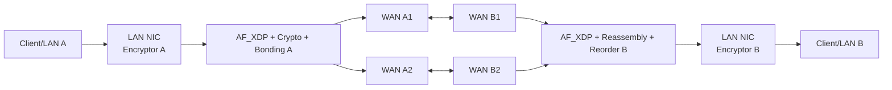

PQC control traffic dùng UDP/7090 trên tunnel IP. CFM dùng Ethernet CFM `0x8902` và được BPF WAN để lại kernel stack cho raw socket. Data traffic đi qua XSK.

### 2.2 Ma trận MTU được hỗ trợ

| LAN MTU | WAN MTU | Kết quả | Hành vi |
|---:|---:|---|---|
| 1500 | 1500 | Hỗ trợ | MSS clamp và UDP split khi encrypted frame vượt 1500 |
| 9000 | 9000 | Hỗ trợ | Cùng thuật toán, ngưỡng đổi thành 9000 |
| 1500 | 9000 | Hỗ trợ | Đa số packet mã hóa vẫn dưới 9000 nên không clamp/split |
| 9000 | 1500 | Từ chối | `interface_validate_mtu_topology()` fail vì code không co jumbo LAN xuống WAN nhỏ hơn |
| 576..9000 | WAN >= LAN | Hỗ trợ về policy | Kích thước thực tế còn phụ thuộc driver/kernel/XDP SG |

Điều kiện đúng là `max(LAN MTU) <= min(WAN dataplane MTU)`. MTU chỉ là ngưỡng packet, không có “mode chỉ nhận đúng 1500” hay “đúng 9000”; mọi kích thước nhỏ hơn hoặc bằng ngưỡng đều đi được.

## 3. Topo phần mềm tổng thể

```mermaid
flowchart TB
    DB[(PostgreSQL)] --> MAIN[main.c<br/>LISTEN config/admin]
    VAULT[(Vault)] --> DBENV[db/vault.c + db_env.c]
    VAULT --> PQCV[pqc_vault.c]
    MAIN --> CFG[app_config]
    CFG --> FWD[forwarder_init]
    CFG --> HS[PQC handshake workers]
    FWD --> BPF1[bpf/lan.c]
    FWD --> BPF2[bpf/wan.c]
    BPF1 --> XSK[Shared AF_XDP UMEM/XSK]
    BPF2 --> XSK
    XSK --> RXLAN[LAN RX threads]
    XSK --> RXWAN[WAN RX threads]
    RXLAN --> CR[Crypto workers]
    RXWAN --> CR
    CR --> TX[TX workers]
    TX --> XSK
    CFM[CFM raw sockets] --> SCHED[WAN scheduler/live state]
    SCHED --> CR
    CR --> STATS[/var/log/core/packet.log]
```

Control plane nạp config và key. Dataplane xử lý packet. Hai phần gặp nhau qua `app_config`, crypto context, trạng thái WAN live/admin và cơ chế hot reload.

## 4. Startup, reload và shutdown

### 4.1 Trình tự khởi động daemon

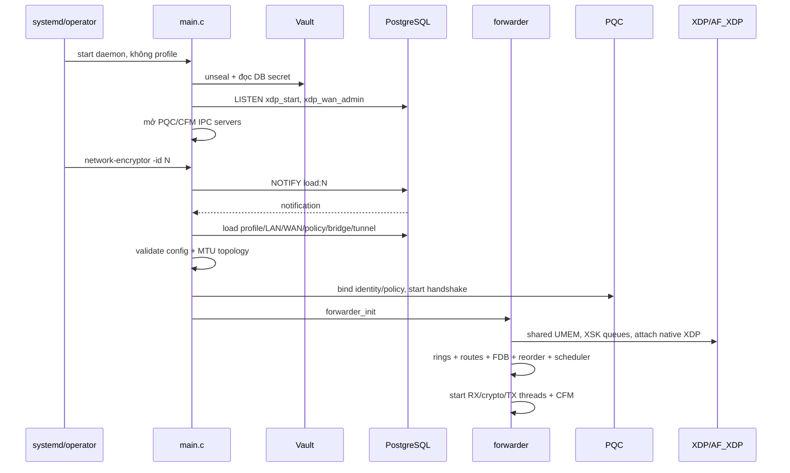

`main()` có hai vai trò:

1. CLI ngắn hạn gửi lệnh qua PostgreSQL/Unix socket rồi thoát.
2. Daemon dài hạn giữ kết nối `LISTEN`, nạp hoặc thay profile và quản lý forwarder thread.

Khi config mới chỉ đổi policy/tuning tương thích, hệ thống request reload để tránh tháo toàn bộ XDP. Khi topology LAN/WAN thay đổi không thể hot-apply an toàn, runtime dừng dataplane cũ rồi khởi tạo lại. Profile bị xóa hoặc load lỗi đưa daemon về trạng thái trống fail-closed.

### 4.2 Trình tự `forwarder_init()`

1. Validate CPU map và MTU topology.
2. Tính path MTU nhỏ nhất của các WAN dataplane, đưa vào crypto option router.
3. Khởi tạo stats, idle wakeup, route/reorder state.
4. Xóa XDP program cũ còn bám interface.
5. Dựng crypto context CURRENT/NEXT/PREV cho policy.
6. Khởi động/bind PQC cho profile và đồng bộ traffic key.
7. Mở shared UMEM, jumbo pool và toàn bộ XSK queue.
8. Load `lan.o`/`wan.o`, attach chương trình `xdp.frags`, điền XSKMAP.
9. Khởi tạo các software ring giữa RX, crypto và TX.
10. Reset scheduler, bootstrap/restore MAC FDB.
11. Start CFM failover.

### 4.3 Shutdown

`forwarder_stop()` đặt stop flag và đánh thức thread đang poll. Cleanup dừng failover, flush/drop packet còn giữ trong reorder, trả frame về pool, persist FDB, hủy rings/XSK/UMEM/BPF theo thứ tự và tắt idle eventfd. Việc xóa XSK giữ UMEM fd được làm sau cùng để tránh phá shared UMEM khi interface khác còn sống.

## 5. Thread và CPU topology

Map mặc định trong `cpu_map.h`:

| Nhóm | CPU | Trách nhiệm |
|---|---|---|
| LAN RX | 0 | Nhận LAN queues, classify, chuyển thẳng bypass hoặc vào crypto ring |
| TX | 1, 2, 9, 10 | Drain CQ, gửi LAN/WAN, interleave WAN để giảm skew |
| Crypto | 3..8 | Policy, encrypt/decrypt, UDP reassembly, TCP/UDP reorder |
| WAN RX | 11 | Nhận WAN queues, classify encrypted/ARP/bypass |

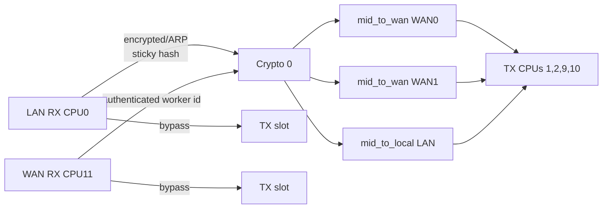

Mỗi crypto worker có ring đầu vào riêng. Mỗi WAN/LAN có ring đầu ra theo worker/ring index. TX slot drain các ring được phân công theo modulo; thiết kế này giữ producer locality nhưng vẫn dùng nhiều TX core.

`idle.c` dùng eventfd + poll với giai đoạn hot/warm/cold. Khi vừa có tải, thread spin rất ngắn; khi rảnh thì poll 1 ms để giảm CPU. Producer gọi wake đúng crypto/TX worker khi đưa packet vào ring trống.

## 6. AF_XDP, UMEM và multi-buffer jumbo

### 6.1 Bộ nhớ

| Thành phần | Giá trị | Vai trò |
|---|---:|---|
| `NE_FRAME` | 4096 byte | Chunk UMEM vật lý cho một XDP descriptor |
| `NE_N_FRAMES` | 524288 | Shared UMEM frame pool |
| `NE_PACKET_CAPACITY` | 12288 byte | Buffer userspace tuyến tính đủ cho frame MTU 9000 + overhead |
| `NE_JUMBO_N_FRAMES` | 8192 | Số jumbo linear buffer |
| `NE_RING` | 16384 entries | Software ring giữa các stage |
| `NE_BATCH_SIZE` | 64 | RX/TX batch |

Địa chỉ packet thường là offset UMEM. Jumbo address bật bit `NE_ADDR_JUMBO_FLAG`, phần còn lại là index trong jumbo pool. Vì vậy `ne_packet_data()`, `ne_packet_capacity()` và `ne_frame_free()` xử lý được cả hai loại bằng cùng API.

### 6.2 RX jumbo

Driver đưa jumbo frame thành chuỗi descriptor có `XDP_PKT_CONTD`. `recv_queue()`:

1. Nếu descriptor đầu không continued, trả thẳng UMEM frame.
2. Nếu là chuỗi, cấp một jumbo linear buffer.
3. Copy từng segment 4K vào buffer cho đến descriptor cuối.
4. Recycle toàn bộ original UMEM chunks.
5. Chỉ trả một `ne_packet` hoàn chỉnh cho dataplane.
6. Nếu chuỗi bị ngắt, quá capacity hoặc hết jumbo pool, đánh dấu drop và thu hồi an toàn ở segment cuối.

### 6.3 TX jumbo

`tx_drain_queue()` nhìn packet tuyến tính và tính `ceil(len / 4096)` descriptors. Nó reserve đủ cả chuỗi trước, cấp đủ UMEM frames, copy từng đoạn, gắn `XDP_PKT_CONTD` cho mọi descriptor trừ descriptor cuối. Nếu không reserve/cấp đủ thì không gửi nửa packet.

Đây là lý do i40e/kernel phải quảng bá RX scatter-gather XDP (`NETDEV_XDP_ACT_RX_SG`) và libxdp bind phải chấp nhận `XDP_USE_SG`. Kích thước một chunk 4K không giới hạn packet ở 4K; packet 9000 thường đi qua ba XDP descriptors, sau đó được linearize thành một userspace packet.

## 7. BPF ingress

### `bpf/lan.c`

`xdp_redirect_prog()` chạy trong section `xdp.frags`. Nó kiểm tra Ethernet header, redirect ARP và IPv4 vào `xsks_map` theo `rx_queue_index`; EtherType khác `XDP_PASS` về kernel.

### `bpf/wan.c`

`xdp_wan_redirect_prog()`:

- `0x8902` CFM luôn `XDP_PASS` để AF_PACKET socket nhận được.
- ARP, NE encrypted ARP `0x1048`, NE UDP `0x104B` được redirect.
- IPv4 ICMP/TCP/UDP/OSPF được redirect.
- Hai fake EtherType runtime trong `wan_config_map` cũng được redirect.
- Loại khác đi kernel.

Nếu XSKMAP không có entry tương ứng queue, `bpf_redirect_map(..., 0)` dùng action fallback 0, tức packet không được userspace xử lý đúng như queue đã plumb; preflight và map population phải hoàn tất trước khi bật traffic.

## 8. Luồng LAN → WAN

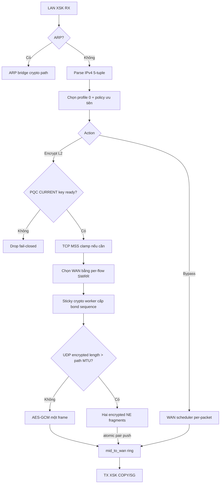

Chi tiết:

- `dataplane_local_needs_mid()` chỉ quyết định có cần crypto worker không. ARP luôn cần; bypass có thể đi trực tiếp từ RX sang TX ring.
- `pick_profile_policy()` hiện chọn `profiles[0]`, xác nhận LAN thuộc profile, rồi gọi matcher.
- `fwd_wan_pick_for_local()` lấy danh sách WAN live, áp weight/ramp/drain và per-flow SWRR.
- TCP/UDP lấy sequence bằng `dp_tcp_next_tx_seq()`/`dp_udp_next_tx_seq()` trên sticky worker.
- `ensure_crypto_capacity()` nâng packet từ UMEM 4K sang jumbo buffer nếu cần thêm tối đa 64 byte.
- Hai UDP fragments được đưa vào cùng một WAN ring bằng `ne_ring_try_push_pair()`. Nếu ring không đủ hai slot, cả cặp bị từ chối; không bao giờ gửi một nửa datagram do local queue pressure.

## 9. Policy forward và reverse

Policy forward LAN→WAN so trực tiếp:

```text
packet.src_ip:src_port -> packet.dst_ip:dst_port
       so với
policy.src_ip:src_port -> policy.dst_ip:dst_port
```

Policy inbound WAN→LAN phải chứng minh packet là chiều trả về của policy:

```text
packet.src_ip:src_port -> packet.dst_ip:dst_port
       so với đảo chiều
policy.dst_ip:dst_port -> policy.src_ip:src_port
```

Trình tự encrypted inbound bắt buộc:

1. Nhận diện NE marker và wire policy ID.
2. Tìm crypto context đúng policy/profile.
3. Xác thực AES-GCM tag; tag sai thì decrypt fail và drop.
4. Khôi phục frame gốc.
5. Parse 5-tuple plaintext.
6. Nếu profile không có catch-all `policy_in_any`, gọi `config_policy_in_ok()` để reverse-match.
7. Không match thì `wan_policy_drop`; chỉ match mới reorder/FDB/TX xuống LAN.

`policy_in_any` là tối ưu hợp lệ khi profile thật sự có encrypted catch-all any/any: bỏ scan policy per packet nhưng vẫn phải xác thực wire policy, key và GCM. Bypass inbound vẫn reverse-select policy để ngăn encrypted policy bị lọt dưới dạng plaintext.

## 10. TCP MSS và sequence

TCP không bị userspace phân mảnh. SYN/SYN-ACK chỉ bị sửa MSS nếu MSS hiện tại khiến frame sau mã hóa vượt path MTU. Công thức logic:

```text
safe_MSS = path_MTU - IPv4_header - TCP_header - NE_wire_overhead
```

Code gọi `crypto_tcp_clamp_mss(..., path_mtu, crypto_option_wire_overhead())`; checksum TCP được cập nhật incremental. Nếu frame + overhead vẫn vừa WAN MTU thì MSS không đổi.

Mỗi TCP packet encrypted có authenticated `(epoch32, seq32)`. Sequence là sequence bonding của packet, không phải TCP sequence number. Nó cho reorder engine biết thứ tự gửi ban đầu ngay cả khi hai WAN giao packet ngược thứ tự.

## 11. UDP full-frame, split và reassembly

### 11.1 Điều kiện split

```text
split khi frame_len + 47 > path_MTU
```

Nếu vừa thì UDP đi nguyên một encrypted frame, vẫn có UDP shim và bond sequence để reorder. Nếu không vừa, `crypto_pqc_udp_fragment_layout()` tạo đúng hai NE fragments:

```text
frag0 plaintext = IPv4 header + UDP header + payload prefix lớn nhất
frag1 plaintext = payload còn lại
frag0 wire_len  = path_MTU (thường sát ngưỡng)
frag1 wire_len  = L2/crypto header riêng + payload còn lại
```

Đây không phải IPv4 fragmentation tiêu chuẩn. Mỗi fragment là một NE frame được mã hóa/xác thực độc lập và mang chung `(epoch, bond_seq, datagram_id)`, khác `kind` FRAG0/FRAG1.

### 11.2 Wire overhead

| Protocol/path | Overhead so với frame gốc | Thành phần chính |
|---|---:|---|
| TCP | 42 byte | policy 1 + worker 1 + nonce 12 + marker 4 + epoch/seq 8 + GCM tag 16 |
| UDP | 47 byte | policy 1 + worker 1 + nonce 12 + marker 4 + kind/epoch/seq/datagram 13 + tag 16 |
| ICMP/OSPF/other L2 | khoảng 30 byte | policy + worker + nonce + tag |

Fake EtherTypes hiện dùng: ARP `0x1048`, general/TCP runtime thường `0x104A`, UDP `0x104B`.

### 11.3 Reassembly WAN→LAN

Reassembly table được tách theo active profile slot và crypto worker:

- 512 entries/table, probe tối đa 8 slot.
- Key: `(epoch, datagram_id, bond_seq)`.
- Nhận FRAG0 hoặc FRAG1 trước đều được.
- Mỗi phần được GCM-verify/decrypt trước khi giữ.
- Chỉ copy plaintext cần thiết vào RAM; không giữ UMEM frame lâu dài.
- Khi đủ hai phần, phục hồi IPv4 total length, UDP length/checksum và frame gốc.
- Timeout 200 ms; GC quét 256 entries mỗi lần gọi.
- Nếu frame ghép vượt capacity của input UMEM frame, cấp jumbo output và chuyển ownership về `job.addr`.

Ước lượng tối đa một table xấp xỉ `512 × ~18 KB ≈ 9 MB`; table được cấp lười theo profile/worker. Sáu worker của một active profile có thể dùng khoảng 55 MB riêng cho reassembly khi đầy.

## 12. Reorder tách biệt cho TCP và UDP

TCP và UDP dùng hai API, hai flow table, hai slot buffer, hai held cap và hai
bộ counter độc lập. `bond_reorder.c` chỉ tái sử dụng cơ chế window/GC; policy
và state không dùng chung. Vì vậy một đợt UDP fragment/reorder lớn không thể
evict flow TCP hoặc chiếm held cap của TCP.

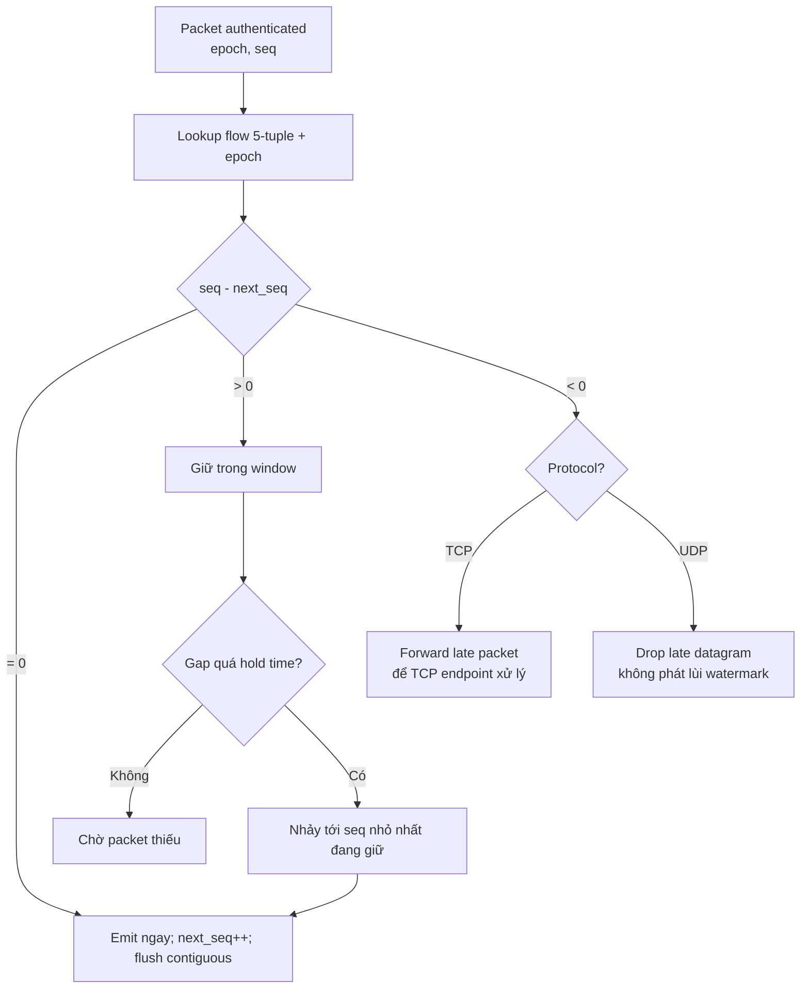

Thông số:

| Thông số | Giá trị |
|---|---:|
| Flow table/worker | 64 sets × 4 ways = 256 flows |
| Window/flow | 4096 sequence slots |
| Tổng packet giữ/worker | 32768 cho TCP + 32768 cho UDP |
| Startup backtrack | 32 sequence |
| Default hold | 2 ms |
| Env range | 100 µs..50 ms |
| Flow idle expiry | 60 s |
| GC slice | 16 flows/call |

Với hai WAN khoảng 0.5/0.6 ms, hold 2 ms tạo khoảng đệm cho scheduling/queue
jitter. Sau khi timeout đã bỏ qua A1 và phát A2, UDP A1 đến muộn bị drop để
application không nhận chuỗi lùi `A2,A1`. TCP A1 đến muộn vẫn được forward vì
TCP sequence/SACK ở endpoint mới quyết định packet đó còn hữu ích hay không;
drop cưỡng bức tại đây có thể làm tăng retransmission. Exact duplicate đang
nằm trong buffer luôn bị drop. Overflow/eviction là pressure thực sự.

Biến môi trường:

- `NE_BOND_REORDER=0` tắt reorder.
- `NE_BOND_REORDER_US=N` đặt hold time.
- `NE_TCP_REORDER=0`, `NE_TCP_REORDER_US=N` chỉnh riêng TCP.
- `NE_UDP_REORDER=0`, `NE_UDP_REORDER_US=N` chỉnh riêng UDP.
- Biến riêng protocol ưu tiên hơn biến `NE_BOND_REORDER*`; cấu hình UDP không
  còn vô tình thay đổi TCP và ngược lại.

## 13. Luồng WAN → LAN

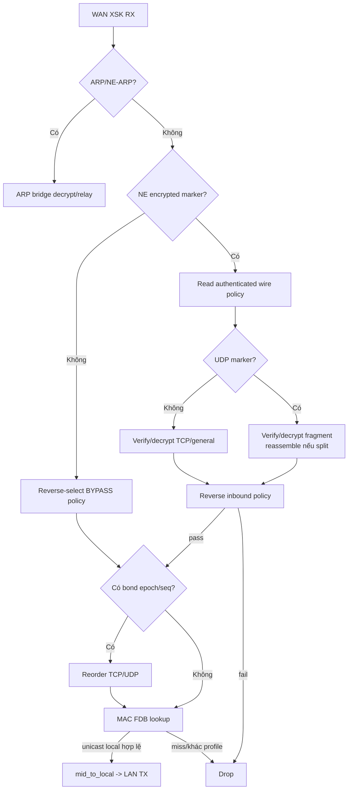

Data IPv4 không flood khi FDB miss. `forward_wan_to_local()` chỉ nhận destination MAC unicast, tìm LAN đã học, xác nhận LAN thuộc profile và đang live. Nếu lookup miss, nó có thể fallback theo bridge pair của ingress WAN; nếu vẫn không có đích hợp lệ thì drop.

## 14. Per-packet bonding và WAN scheduler

`flow_table.c` dùng canonical bidirectional 5-tuple để hai chiều connection nhận cùng flow identity. Mỗi RX/crypto thread có bảng SWRR riêng gồm 512 sets × 4 ways.

Smooth Weighted Round Robin hoạt động per packet:

1. Mỗi WAN cộng effective weight vào current weight.
2. Chọn WAN có current weight lớn nhất.
3. Trừ tổng weight khỏi WAN vừa chọn.
4. Lặp lại cho packet tiếp theo của cùng flow.

Ví dụ weight 70:30 sinh phân bố gần 7 packet WAN0, 3 packet WAN1 theo thời gian, nhưng xen kẽ mượt hơn một block 7 rồi block 3.

`wan_scheduler.c` còn lọc:

- interface có XSK/live hay không;
- CFM có đánh excluded/down không;
- admin có KICK/HOLD không;
- TX ring còn room không;
- drain taper 5 giây khi tháo WAN;
- join ramp và weight blend 5 giây khi thêm/khôi phục WAN;
- fallback WAN ít queue nhất khi lựa chọn chuẩn không dùng được.

Giới hạn 8–9 Gbit/s là giới hạn payload trên từng link 10G sau overhead, không phải giới hạn tổng toàn hệ thống. Hai card độc lập có thể cộng băng thông nếu PCIe, memory bandwidth, crypto workers, UMEM/rings và CPU đều còn headroom.

## 15. Crypto route và tránh khóa đa core

`crypto_route.c` giữ route state theo flow:

- LAN flow mới được gán crypto worker ít connection hơn; về sau giữ nguyên worker.
- Encrypted wire mang `core_id`, nên WAN RX đưa packet về đúng worker đã tạo sequence ở peer.
- Mỗi direction có TCP và UDP counter riêng.
- Sau decrypt, flow được gán TX slot ổn định nhưng cân bằng độc lập với crypto worker.
- Bypass không cần crypto state nên hash thẳng ra TX slot.

Lý do: nếu một flow nhảy giữa crypto worker, counter có thể đụng nhau, fragment pair có thể vào hai table khác nhau và reorder state bị tách. Sticky worker giải quyết cả ba mà không phải khóa mỗi packet.

## 16. Nonce, AES-GCM và vòng đời key

### 16.1 Code nonce hiện tại

`trf_pqc_generate_nonce()` tạo 12 byte:

```text
nonce = random_salt_per_thread[8] || counter_per_thread[4]
```

Salt được sinh một lần khi thread lần đầu mã hóa. Counter tăng cho mỗi lần encrypt, nên mỗi UDP fragment lấy nonce riêng. Một datagram hai fragment dùng hai nonce khác nhau.

**Cảnh báo hiện trạng:** counter là 32-bit và code không kiểm tra wrap. Sau `2^32` lần encrypt trên cùng thread, counter quay lại và nonce có thể lặp dưới cùng key/salt. Với AES-GCM đây là lỗi an toàn nghiêm trọng. Thiết kế nên đổi thành prefix duy nhất theo session/worker + counter 64-bit, hoặc fail-closed/request rekey trước wrap. Việc đổi nonce không cần thay scheduler/reassembly/băng thông đáng kể.

### 16.2 Key slots

Mỗi policy crypto context có:

- `CURRENT`: key dùng để encrypt.
- `NEXT`: key đã stage trong rotation, decrypt được để chịu lệch cutover.
- `PREV`: key cũ chỉ giữ trong grace period.

Decrypt thử `CURRENT → NEXT → PREV`. Encrypt luôn dùng CURRENT. Worker có immutable private copy, chỉ đồng bộ lại khi atomic generation thay đổi; fast path không khóa global key mutex mỗi packet.

Traffic key lifetime là 30 ngày tính từ khi CURRENT key khác zero được lưu RAM. Hết hạn, maintenance tick yêu cầu PQC session mới. Reload config có previous-context grace 3 giây; handshake rotation có PREV grace khoảng 90 giây.

### 16.3 AAD

**Cảnh báo hiện trạng:** `HARDCODED_AAD` chỉ có 8 byte nhưng `aad_len` được đặt 12. Tuy nhiên hai lệnh gọi `scrypt_CipherUpdateAAD()` trong `traffic_crypto.c` hiện đang bị comment, nên AAD thực tế chưa được GCM authenticate. Phải sửa đồng thời độ dài và bật xử lý AAD trước khi tuyên bố header/AAD đã được bảo vệ đầy đủ.

## 17. PQC handshake và key rotation

Handshake chạy UDP port 7090, magic `PQCH`, theo policy. Các message:

| Message | Vai trò |
|---|---|
| HELLO | Initiator gửi session/request, KEM public material và chữ ký |
| RESP | Responder encapsulate, trả ciphertext/chữ ký |
| KEEPALIVE | Chứng minh peer còn sống và báo state/key identity |
| POKE | Đánh thức/request handshake |
| READY | Hai phía chứng minh NEXT đã sẵn sàng |
| COMMIT | Đồng bộ thời điểm chuyển NEXT thành CURRENT |

Thuật toán chính:

1. Load local ML-DSA identity và peer public identity từ Vault/registry.
2. Xác định initiator/responder theo tunnel config/IP.
3. ML-KEM tạo shared secret; ML-DSA xác thực handshake messages.
4. Derive 32-byte traffic key bằng digest/HKDF logic.
5. Handshake đầu đưa key vào CURRENT; rotation đưa vào NEXT.
6. READY/COMMIT đảm bảo hai bên không chuyển key đơn phương.
7. Giữ PREV để giải mã packet đang bay, rồi wipe.
8. Responder cache bốn handshake gần nhất để HELLO retransmit không tạo key khác.

Timeout chính: request retry 1 s, give-up 15 s, keepalive 15 s, ba keepalive miss thành 45 s, auto retry 15 s, dispatcher/supervisor 5 s.

## 18. ARP bridge và MAC FDB

ARP không đi qua policy IPv4. `arp_bridge.c`:

- LAN→WAN: học source MAC/client IP, chọn bridge WAN chính hoặc backup live, mã hóa ARP rồi gửi.
- WAN→LAN: nhận plain/NE-ARP, giải mã nếu cần; ARP broadcast/who-has có thể relay tới các LAN thuộc profile, unicast dựa trên FDB.
- Wire ID ARP dành riêng là 250, fake EtherType `0x1048`.
- Relay stamp chống lặp trong thời gian ngắn.

`mac_learn.c` giữ tối đa 256 entries và hash 256 buckets. Nó không học multicast, zero MAC hoặc MAC của chính appliance; enforce một learned client MAC trên mỗi LAN ifname; persist vào `/var/log/NE/mac_lan.log`, restore khi start và purge orphan khi config đổi.

**Cảnh báo hiện trạng:** ARP đang dùng một master key 32 byte hardcode trong `arp_bridge.c`. Nó có crypto context riêng và wire ID riêng, nhưng chưa có PQC handshake/key lifetime/nonce namespace riêng đúng với thiết kế “ARP auto key độc lập”. Không nên log toàn bộ key thật; để đối chiếu hai đầu chỉ nên log key ID/fingerprint ngắn.

## 19. Failover, CFM và admin WAN

CFM dùng raw `AF_PACKET` socket trên từng WAN và CCM interval 100 ms. Timeout 350 ms, startup timeout 1000 ms, cần hai lần xác nhận down và ba lần xác nhận up. Khi down, WAN được excluded khỏi scheduler; khi up, join ramp tránh đổ burst ngay lập tức.

`wan_admin.c` cung cấp:

- `-di <ifname>`: drain traffic, admin-hold, tháo XDP/XSK an toàn.
- `-ai <ifname>`: plumb XSK/XDP trở lại, clear hold và join ramp.
- `-gs <wan_if|bridge>`: query CFM qua `/var/run/network-encryptor-gs.sock`.

Drain 5 giây giảm effective weight dần trước khi detach. Đây là bảo vệ packet đang nằm trong ring; tháo ngay interface đang có queue sẽ biến queued traffic thành drop.

## 20. Stats và chẩn đoán nghẽn

`stats.c` ghi `/var/log/core/packet.log` thay vì spam terminal. Có bốn cửa sổ 10 phút, 30 phút, 1 giờ, 1 ngày.

Traffic được tách:

- LAN→WAN và WAN→LAN;
- TCP và UDP;
- MTU buckets: `<=1500`, `1501..3000`, `3001..5000`, `5001..7000`, `7001..9000`, `>9000`.

Drop/pressure gồm RX ring full, mid/crypto ring drop, TX full, XDP statistics, UMEM/jumbo pool, reorder held/released/late/gap/overflow/evicted và queue depth/high-water.

Cách đọc nghẽn:

| Dấu hiệu | Khả năng nguyên nhân |
|---|---|
| RX XDP/ring drop tăng | RX core không drain kịp, FQ thiếu hoặc driver queue pressure |
| `mid_ring_drop`/crypto ring tăng | Crypto worker chậm hoặc sticky-worker mất cân bằng |
| TX full tăng | NIC/link/ring TX không drain kịp, vượt link rate |
| jumbo pool thấp/drop tăng | Jumbo linearization/reassembly giữ buffer quá lâu |
| reorder `held` tăng nhưng `released` theo kịp | Skew bình thường được hấp thụ |
| `gap_skipped` tăng | Packet mất hoặc đến chậm hơn hold time |
| `overflow`/`evicted` tăng | Window/table/RAM cap bị ép, có drop do core/state pressure |

**Khoảng trống chẩn đoán:** code hiện chưa xuất bộ counter chi tiết cho UDP reassembly như auth-fail, FRAG0 timeout, FRAG1 timeout, duplicate fragment, table collision/full và join failure. Vì mục tiêu chính là debug UDP drop/reorder, đây là nhóm counter nên bổ sung trước test dài ngày.

## 21. Danh mục file và hàm

Phần này liệt kê mọi file nguồn sở hữu bởi dự án. Với file rất lớn, các static helper cùng một thuật toán được gom thành nhóm; public entry point được nêu tên đầy đủ.

### 21.1 Entry point và database

| File | Hàm/nhóm hàm | Trách nhiệm |
|---|---|---|
| `main.c` | `main`, `usage`, parse/notify helpers | CLI, signal, LISTEN PostgreSQL, dispatch profile/WAN admin |
| `main.c` | `runtime_start`, `runtime_stop_forwarder`, `forwarder_thread_main` | Vòng đời forwarder thread |
| `main.c` | `policy_fields_equal`, `policies_db_unchanged`, `profile_db_unchanged`, `config_db_unchanged`, `runtime_tuning_only_change` | Phân biệt no-op, hot reload và full restart |
| `main.c` | `apply_active_configs`, `load_profile_and_run`, `return_to_blank_daemon`, `handle_profile_notify` | Apply config fail-closed |
| `src/db/config.c` | parse CIDR/netmask/hex helpers | Chuẩn hóa input policy |
| `src/db/config.c` | `config_validate` | Kiểm tra profile/interface/bridge/policy và uniqueness |
| `src/db/config.c` | `config_select_crypto_policy` | Chọn policy forward theo priority/5-tuple |
| `src/db/config.c` | `config_refresh_policy_in_any`, `config_policy_in_ok` | Cache catch-all và reverse-policy inbound |
| `src/db/config.c` | WAN cfg↔dp mapping helpers | Chuyển index DB sang compact dataplane index |
| `src/db/db_config.c` | string/IP/port/protocol/action parsers, `alloc_wire_policy_id` | Chuyển row DB thành wire-safe config |
| `src/db/db_config.c` | `load_profiles_and_policies`, `load_local_rows`, `load_wan_rows`, bridge/tunnel loaders | Nạp các bảng và join |
| `src/db/db_config.c` | `config_apply_crypto_from_policies`, `config_load_from_db` | Hoàn thiện app_config và bind PQC policy |
| `src/db/db_runtime.c` | `ne_profile_id_exists` | Validate profile trước khi thay runtime |
| `src/db/db_env.c` | `load_ne_env`, `ne_postgres_conn_fill`, `resolve_db_password` | Allowlist secret và tạo libpq parameters |
| `src/db/vault.c` | HTTP/Vault parse/unseal/KV helpers | Bootstrap DB credentials từ Vault |
| `schema.sql` | 11 bảng | Profile, LAN, WAN, bridge, policy, PQC key/tunnel và join tables |

### 21.2 Forwarder và scheduling

| File | Hàm/nhóm hàm | Trách nhiệm |
|---|---|---|
| `forwarder.c` | `forwarder_init`, `forwarder_run`, `forwarder_cleanup`, stop helpers | Vòng đời dataplane |
| `forwarder.c` | LAN RX/WAN RX worker loops | Batch receive, classify direct/mid, stats, FQ refill |
| `forwarder.c` | crypto worker loop | Pop WAN trước rồi LAN, process crypto, định kỳ frag/reorder GC |
| `forwarder.c` | TX worker loop | CQ drain, local TX, rotating interleave WAN TX, maintenance |
| `forwarder.c` | runtime lock + CPU pin helpers | Serialize reload/admin và affinity |
| `config_reload.c` | request/apply reload helpers | Queue config mới, snapshot old crypto, PQC prepare/finalize, apply ở TX0 |
| `crypto_runtime.c` | `fwd_crypto_rebuild`, reset/index helpers | Dựng context theo encrypted policies và wire ID |
| `crypto_runtime.c` | `policy_crypto_sync_worker`, context getters | Master-to-worker immutable generation copy |
| `crypto_runtime.c` | `fwd_crypto_sync_pqc_session_keys`, `forwarder_pre_diversify_pqc_keys` | Đồng bộ CURRENT/NEXT/PREV từ handshake |
| `crypto_runtime.c` | lifetime/grace/key-time functions | 30-day rekey, PREV wipe, CLI remaining time |
| `crypto_runtime.c` | `fwd_crypto_frag_gc_worker_tick` | Reassembly GC theo crypto worker |
| `wan_scheduler.c` | runtime WAN/live/admin/drain/join helpers | Effective WAN pool và state transition |
| `wan_scheduler.c` | `fwd_wan_pick_for_local` | Chọn WAN per packet theo SWRR + load/room |
| `wan_scheduler.c` | cfg/dp index and ring-room helpers | Mapping và backpressure |

### 21.3 AF_XDP và profile interface

| File | Hàm/nhóm hàm | Trách nhiệm |
|---|---|---|
| `xdp_interface.c` | `ne_ring_*` | MPSC/SPSC software rings, atomic pair push |
| `xdp_interface.c` | `pool_*`, `ne_frame_*`, `ne_packet_*` | Shared UMEM và jumbo address pools |
| `xdp_interface.c` | interface queue/promisc/MTU/preflight helpers | Chuẩn bị NIC và validate môi trường |
| `xdp_interface.c` | UMEM/XSK create/delete/plumb/unplumb helpers | Shared socket lifecycle, rollback-safe |
| `xdp_interface.c` | `recv_queue`, `recv_pair_slot`, `ne_recv_*` | RX descriptors và SG linearization |
| `xdp_interface.c` | CQ/FQ drain/refill/kick helpers | Ownership recycling và NEED_WAKEUP |
| `xdp_interface.c` | `tx_drain_queue`, `ne_tx_drain_*` | Linear packet thành descriptor chain, kick TX |
| `xdp_interface.c` | fd collectors, XDP statistics | Poll integration và kernel counters |
| `profile_xdp.c` | BPF load/find/attach/detach/map helpers | Native XDP attach và XSKMAP population |
| `profile_xdp.c` | profile local/WAN bind functions | Bind object/program/map với đúng interface |
| `profile_lifecycle.c` | add/remove local/WAN helpers | Hot-plumb topology và rollback metadata |
| `interface.h` | packet/ring/pool/XSK/pair structs | ABI nội bộ của memory dataplane |
| `mtu_policy.h` | `ne_mtu_topology_supported` | Quy tắc LAN MTU <= WAN MTU |

### 21.4 Dataplane packet path

| File | Hàm/nhóm hàm | Trách nhiệm |
|---|---|---|
| `local_egress.c` | `dataplane_local_needs_mid`, `pick_profile_policy` | Classify LAN bypass/crypto |
| `local_egress.c` | `ensure_crypto_capacity`, split tail cache | Bảo đảm tailroom và giảm alloc cost |
| `local_egress.c` | `encrypt_to_wan`, `push_split_to_wan`, `push_to_wan` | Sequence, encrypt/split và enqueue atomic |
| `local_egress.c` | `dataplane_process_local` | Luồng LAN→WAN đầy đủ |
| `wan_ingress.c` | wire-marker/policy/profile helpers | Phân biệt bypass/encrypted và ownership |
| `wan_ingress.c` | `decrypt_l2`, `wan_try_l2_pqc_udp`, `reassemble_l2`, `decrypt_wan` | Auth/decrypt/reassembly |
| `wan_ingress.c` | `wan_policy_in_ok`, `wan_profile_pi_bypass` | Reverse-policy fail-closed |
| `wan_ingress.c` | `forward_wan_to_local`, reorder callbacks | FDB bridge và TX enqueue |
| `wan_ingress.c` | `dataplane_process_wan` | Luồng WAN→LAN đầy đủ |
| `packet_util.c` | `dp_parse_flow`, `dp_parse_arp_ips`, packet tests/ring push | Parser bounds-safe và helper chung |
| `crypto_route.c` | worker/route lookup, canonical hash | Sticky crypto worker và route table |
| `crypto_route.c` | TCP/UDP next sequence | Monotonic bond sequence per flow/direction |
| `crypto_route.c` | TX slot selection/bind | Affinity sau decrypt và bypass hash |
| `bond_reorder.c` | flow lookup/reset/evict, flush/skip/window-room | Cơ chế reorder dùng lại, chứa hai engine/state độc lập |
| `tcp_reorder.c` | TCP submit/GC/reset/stats/config | Policy TCP: forward packet đến muộn |
| `udp_reorder.c` | UDP submit/GC/reset/stats/config | Policy UDP: drop packet đến muộn sau watermark |
| `stats.c` | observe/counter functions | Atomic fast-path counters |
| `stats.c` | snapshot/report/tick | Delta windows và packet.log |
| `idle.c` | init/arm/wake/poll/shutdown | Adaptive idle cho crypto/TX threads |

### 21.5 Flow, ARP và failover

| File | Hàm/nhóm hàm | Trách nhiệm |
|---|---|---|
| `flow_table.c` | normalize/hash/SWRR state helpers | Canonical flow và smooth weights |
| `flow_table.c` | `flow_table_pick_wan_per_flow_packet` | Per-packet multi-WAN selection |
| `mac_learn.c` | table/hash/upsert/lookup helpers | MAC→LAN FDB |
| `mac_learn.c` | iface MAC filtering, one-MAC enforcement | Không học MAC appliance/sai LAN |
| `mac_learn.c` | persist/load/merge/purge helpers | `/var/log/NE/mac_lan.log` lifecycle |
| `mac_learn.c` | `mac_learn`, `mac_lookup`, bootstrap/tick/shutdown | Public FDB API |
| `mac_learn.c` | relay stamp helpers | Chống ARP relay loop ngắn hạn |
| `arp_bridge.c` | profile/bridge/WAN selection helpers | Xác định đường ARP |
| `arp_bridge.c` | ARP crypto context/encrypt/decrypt helpers | NE-ARP path riêng |
| `arp_bridge.c` | `arp_bridge_from_local`, `arp_bridge_from_wan` | Relay/học/flood có kiểm soát |
| `cfm_diag.c` | CCM encode/send/receive/monitor thread | Phát hiện WAN L2 up/down |
| `cfm_diag.c` | `cfm_init`, `cfm_cleanup`, snapshots | Lifecycle và scheduler update |
| `cfm_diag.c` | CFM status IPC helpers | `-gs` query |
| `wan_failover.c` | start/on_cfg/stop/excluded | Adapter CFM vào forwarder |
| `wan_admin.c` | notify/admin/drain/plumb helpers | KICK/RESTORE WAN an toàn |

### 21.6 Crypto framework và PQC

| File | Hàm/nhóm hàm | Trách nhiệm |
|---|---|---|
| `crypto_option_registry.c` | registry init/lookup | Map option+protocol tới ops implementation |
| `crypto_option_router.c` | worker binding, TLS TX/RX metadata | Epoch/seq/datagram state per thread |
| `crypto_option_router.c` | MTU/overhead/need_split/encrypt/decrypt/reasm wrappers | API thống nhất dataplane→crypto option |
| `eth_parse.c` | EtherType/VLAN/IPv4/ARP offsets and marker readers | Parser wire L2 bounds-safe |
| `eth_parse.c` | `crypto_tcp_clamp_mss` | MSS edit + incremental checksum |
| `packet_crypto.c` | init/get/refresh/wipe key slots | Policy crypto context lifecycle |
| `opt_no_frag_ops.c` | generic ops for non-UDP protocols | Encrypt/decrypt không reassembly |
| `pqc_l2_common.c` | offset/header và generic IPv4 codec | Primitive wire/nonce/GCM dùng chung |
| `pqc_l2_tcp.c` | TCP ops | Marker, epoch/sequence và legacy decrypt fallback |
| `pqc_l2_udp.c` | UDP ops | Full/split, fragment parse, reassembly table và GC |
| `pqc_l2_icmp.c` | ICMP ops | Pipeline ICMP độc lập trên generic IPv4 codec |
| `pqc_l2_ospf.c` | OSPF ops | Pipeline OSPF độc lập trên generic IPv4 codec |
| `pqc_l2_arp.c` | ARP ops | Fake EtherType và ARP payload codec riêng |
| `traffic_crypto.c` | global init/cleanup/random/nonce | Wrapper libscrypt và nonce TLS |
| `traffic_crypto.c` | GCM/CBC/HMAC/digest/HKDF wrappers | Symmetric primitives |
| `traffic_crypto.c` | KEM/DSA generate/encap/decap/sign/verify | PQC primitives |
| `traffic_crypto.c` | base64/obfuscate/file helpers | Key serialization utility |
| `pqc_handshake.c` | policy registry/worker/dispatcher/supervisor | Một state machine per policy |
| `pqc_handshake.c` | session/request ID, HELLO/RESP handlers | Initial key establishment |
| `pqc_handshake.c` | KEEPALIVE/POKE/READY/COMMIT handlers | Liveness và synchronized rotation |
| `pqc_handshake.c` | cache/queue/retry helpers | Idempotency và packet loss tolerance |
| `pqc_handshake.c` | start/reload/get-key/request-session public API | Tích hợp control plane/runtime |
| `pqc_vault.c` | Vault URL/env/HTTP/JSON/unseal/read/write | PQC identity storage |
| `pqc_ipc.c` | Unix listener/CLI/gen identity | PQC operator commands |
| `pqc_logger.c` | timestamp/write/retention | `/var/log/NE/authen_pqc.log` |

### 21.7 Header và build/deploy files

- `inc/core/**`: khai báo public API, CPU counts, config structures, forwarder/ring/FDB/reorder/failover types.
- `inc/crypto/**`: façade header cho crypto option, packet crypto, PQC fragments/handshake và vendor `scrypt.h`.
- `src/crypto/pqc/include/**`: header nội bộ PQC; một số được façade `inc/crypto` include lại.
- `Makefile`: build BPF bằng clang target BPF; build userspace `-O2 -Wall -mcmodel=medium`; link libbpf/libxdp/OpenSSL/libpq/libscrypt.
- `network-encryptor.service`: lifecycle systemd và quyền runtime.
- `docs/MTU_9000_XDP_COPY_I40E.md`: hướng dẫn riêng về i40e, XDP_COPY/DRV/SG và MTU 9000.

## 22. Invariant về ownership và drop

Mỗi `ne_packet.addr` phải có đúng một owner:

1. RX descriptor chuyển ownership từ kernel/UMEM sang RX thread.
2. Push ring thành công chuyển ownership sang consumer ring.
3. Reassembly pending copy dữ liệu rồi trả/free original tùy mã trả về đã quy ước.
4. Reorder hold giữ ownership packet cho đến emit/drop/reset.
5. TX submission chuyển UMEM chunks sang NIC; CQ trả chúng về pool.
6. Mọi failure trước khi transfer phải gọi `ne_frame_free()` đúng một lần.

Các điểm drop hợp lệ cần giám sát:

- packet invalid/truncated hoặc loại không được policy;
- encrypted marker nhưng thiếu context/key;
- GCM authentication failure;
- reverse-policy failure;
- WAN không live/không TX room;
- software ring full;
- hết UMEM/jumbo/split-tail buffer;
- fragment timeout/table collision/invalid join;
- reorder exact duplicate, cap overflow hoặc flow eviction;
- FDB miss/DMAC multicast trên IPv4 data path;
- XDP RX/TX driver/ring errors.

CPU còn rảnh không chứng minh không có drop: một queue, một sticky worker, TX ring, memory pool hoặc lock cụ thể có thể nghẽn trong khi tổng CPU thấp. Vì vậy phải đọc counter theo stage và per-worker/per-slot, không chỉ xem `%CPU` toàn máy.

## 23. Giới hạn và việc nên làm tiếp

Ưu tiên kỹ thuật dựa trên code hiện tại:

1. Sửa nonce thành 12 byte với unique session/worker prefix + 64-bit counter; fail-closed/rekey trước wrap.
2. Sửa AAD length và thực sự gọi GCM AAD update ở cả encrypt/decrypt.
3. Thay ARP hardcoded key bằng PQC lifecycle riêng hoặc ít nhất key cấu hình riêng an toàn; chỉ log fingerprint.
4. Thêm UDP reassembly cause counters vào `packet.log`.
5. Thêm versioned wire compatibility test giữa hai thiết bị trước khi đổi nonce/AAD/layout.
6. Test soak theo bậc 10m → 30m → 1h → 1d, riêng TCP/UDP và từng MTU/topology.
7. Với mỗi test, đối chiếu link rate, XDP stats, ring depth, pool free, reorder gap/overflow và iperf retransmit.

## 24. Tóm tắt mental model

Có thể hiểu toàn bộ dự án bằng chuỗi sau:

```text
DB/Vault
  -> app_config + PQC identities
  -> native XDP redirects selected L2 traffic
  -> AF_XDP converts descriptor chains thành one userspace packet
  -> RX phân loại bypass hoặc sticky crypto worker
  -> policy + WAN SWRR + bond sequence
  -> MSS clamp hoặc UDP two-fragment khi thật sự vượt MTU
  -> AES-GCM CURRENT key
  -> TX qua một trong nhiều WAN
  -> peer verify/decrypt/reassemble
  -> reverse-policy
  -> TCP/UDP reorder theo authenticated epoch+sequence
  -> MAC FDB/bridge ownership
  -> LAN TX
```

Ba cơ chế giải quyết ba vấn đề khác nhau: UDP reassembly phục hồi một datagram đã bị NE chia đôi; bond reorder phục hồi thứ tự giữa nhiều packet đi nhiều WAN; TCP endpoint retransmission xử lý mất packet còn lại. Trộn ba khái niệm này sẽ dẫn đến chỉnh sai timeout hoặc dùng thêm RAM mà không chữa đúng điểm nghẽn.

## 25. Hướng dẫn đọc source để bảo trì và mở rộng

Phần từ đây trở đi là phần quan trọng nhất đối với người sửa code. Không nên đọc tuần tự toàn bộ repository. Thứ tự đọc hiệu quả là:

1. `interface.h` để hiểu `ne_packet`, ring, pool và `ne_pair`.
2. `forwarder.h` và `forwarder.c` để hiểu thread nào sở hữu stage nào.
3. `local_egress.c` và `wan_ingress.c` để hiểu hai call graph packet.
4. `crypto_route.c`, `wan_scheduler.c`, `bond_reorder.c`, `tcp_reorder.c` và `udp_reorder.c` để hiểu state per-flow.
5. `crypto_option_router.c`, nhóm `pqc_l2_*.c`, `crypto_runtime.c` để hiểu wire format và key.
6. `pqc_handshake.c` để hiểu control-plane key rotation; không đọc file này trước dataplane.
7. `arp_bridge.c`, `mac_learn.c`, `cfm_diag.c`, `wan_admin.c` để hiểu traffic phụ trợ và failover.
8. `config.c`, `db_config.c`, `main.c` để hiểu cách state được tạo và thay đổi khi vận hành.

### 25.1 Bốn hợp đồng không được phá

Mọi thay đổi phải giữ bốn hợp đồng sau:

- **Ownership:** tại mọi thời điểm một packet address có đúng một owner. Hàm consume packet không được caller free lại.
- **Ordering:** một encrypted TCP/UDP flow phải ở cùng crypto worker; sequence được cấp trước khi mã hóa và được authenticate trên wire.
- **Wire compatibility:** hai đầu phải dùng cùng marker/version/layout, endian, overhead và key slot behavior.
- **Fail-closed:** marker/key/tag/policy không hợp lệ phải drop, không được rơi sang bypass plaintext.

### 25.2 Quy ước return code dễ nhầm

| Hàm | Return | Ownership sau return |
|---|---|---|
| `ne_ring_try_push()` | `0` thành công, khác 0 full/lỗi | Thành công: ring; lỗi: caller vẫn giữ |
| `dp_ring_push()` | `0` thành công, `-1` lỗi | Luôn consume: lỗi cũng tự free frame |
| `ne_recv_*()` | số complete packet | Packet trong output thuộc caller; descriptor đã peek phải gọi `ne_recv_release_*()` |
| `crypto_option_encrypt/decrypt()` | `0` thành công | In-place, caller vẫn sở hữu buffer |
| UDP `reasm()` | `1` complete, `0` pending, `-1` lỗi | Pending giữ bản copy trong table, không giữ UMEM input |
| `decrypt_wan()` | `0` complete, `1` pending-copy, `2` pending-hold, `-1` lỗi | Caller xử lý khác nhau; hiện reassembly copy nên nhánh `2` hầu như không dùng |
| `dataplane_process_local/wan()` | `void` | Luôn consume `job`: enqueue, hold hoặc free |
| reorder `submit()` | `void` | Luôn consume item: emit, hold hoặc drop callback |

Không được suy luận ownership chỉ từ return code chung `0/-1`; phải xem hợp đồng từng tầng.

## 26. Phân tích sâu `forwarder.c`: bộ điều phối thread

### 26.1 State toàn cục

- `running`: atomic stop flag được tất cả dataplane thread đọc.
- `runtime_lock`: serialize reload/admin với maintenance ở TX0.
- `tx_maint_tick`: bộ chia tần số cho maintenance; chỉ TX slot 0 cập nhật.

`forwarder` giữ toàn bộ state dataplane của một active profile: config pointer, interface metadata, shared `ne_pair`, input rings, output rings, thread handles, split-tail cache và MAC table.

### 26.2 `forwarder_init(fwd, cfg)`

Đây là constructor lớn nhất của dataplane. Input `cfg` phải còn sống suốt vòng đời forwarder vì `fwd->cfg` chỉ giữ pointer. Hàm trả `0` khi toàn bộ resource đã sẵn sàng; bất kỳ lỗi nào trả `-1` và một số nhánh gọi cleanup nội bộ.

Thứ tự trong hàm mang ý nghĩa dependency:

1. `interface_validate_mtu_topology()` phải chạy trước allocate lớn.
2. `crypto_option_set_mtu()` phải chạy trước bất kỳ packet encryption nào.
3. `fwd_crypto_rebuild()` phải tạo wire-id map trước khi RX encrypted traffic.
4. PQC worker có thể bắt tay song song, nhưng packet encrypt bị chặn đến khi key ready.
5. `ne_pair_open()` tạo XSK trước khi BPF map được populate.
6. `profile_iface_xdp_attach_init()` chỉ attach sau khi XSK tồn tại.
7. Software rings phải tạo trước khi thread start.
8. Scheduler/FDB/failover được init sau interface topology đã cố định.

Khi thêm một subsystem mới, đặt init ngay sau dependency của nó và bổ sung cleanup theo thứ tự đảo ngược. Không start thread trước khi tất cả state nó đọc đã publish hoàn chỉnh.

### 26.3 `local_rx_thread()`

Call graph nóng:

```text
refill FQ
 -> ne_recv_local_slot
 -> ne_recv_release_local_slot
 -> từng packet:
      dataplane_local_needs_mid
       ├─ true: dp_crypto_pick_local_worker -> local_to_mid[worker]
       └─ false: dp_pick_tx_slot -> dataplane_process_local
```

Điểm quan trọng:

- `ne_recv_release_local_slot()` release RX descriptors đã peek, nhưng không tự free frame đã chuyển vào `batch`.
- Nếu `local_to_mid` full, RX thread phải tự tăng counter và `ne_frame_free()`.
- `dataplane_local_needs_mid()` chỉ là classifier; không được mutate packet hoặc cấp sequence ở đây.
- Bypass gọi thẳng `dataplane_process_local()` trên RX CPU. Vì vậy mọi code thêm vào hàm đó không được mặc định luôn chạy trên crypto CPU.
- `flow_table_thread_init()` tạo TLS SWRR state cho chính RX thread, vì bypass cũng cần scheduler.

### 26.4 `wan_rx_thread()`

Tương tự LAN RX nhưng worker selection khác:

- ARP dùng flow hash.
- Encrypted data đọc authenticated wire worker/core ID và trả về crypto worker tương ứng.
- Marker lỗi hoặc worker ID không hợp lệ bị drop trước crypto ring.
- WAN đã stopped/admin-held thì packet bị free ngay.
- Plain bypass đi trực tiếp vào `dataplane_process_wan()`.

Không được đổi `dp_crypto_pick_wan_worker()` thành round-robin: làm vậy tách reassembly/reorder state của cùng flow.

### 26.5 `crypto_worker_thread()`

Mỗi worker bind ba TLS context:

- route worker qua `dp_crypto_worker_bind()`;
- crypto option worker ID qua `crypto_option_bind_worker_idx()`;
- shared packet pool cho reassembly qua `crypto_l2_pqc_bind_pair()`.

Worker pop tối đa một WAN job rồi một LAN job mỗi vòng, nghĩa là cố ý cân bằng hai chiều. Mỗi 2048 vòng khi crypto bật, nó gọi cả fragment GC và reorder GC. Khi stop, nó reset reorder worker để mọi packet held được drop/free qua callback.

Nếu tăng batch crypto, phải kiểm tra lại latency WAN→LAN, fairness hai chiều và tần suất GC; không chỉ đo throughput.

### 26.6 `tx_thread()`

Thứ tự mỗi vòng:

1. TX0 thử lấy `runtime_lock`, apply reload pending và chạy maintenance mỗi 1024 vòng.
2. Drain completion queues để trả UMEM frames.
3. Drain LAN output theo burst.
4. Mỗi vòng gửi một XSK batch cho từng WAN, xoay `wan_cursor`.
5. Không có việc thì arm idle event rồi kiểm tra ring lại để tránh lost wakeup.

Việc interleave WAN là một phần của thuật toán chống reorder. Đừng đổi lại thành drain sạch WAN0 rồi mới WAN1; scheduler có thể chia packet đúng nhưng TX burst sẽ tự tạo thêm skew.

### 26.7 `dp_maint_tick()`

Đây là nơi nối các state machine chậm:

- expire crypto previous-context grace;
- kiểm tra 30-day PQC key lifetime;
- hoàn tất WAN drain;
- tiến weight blend/join ramp;
- MAC FDB maintenance;
- ghi stats window.

Task maintenance mới phải ngắn và không block vì đang chạy trong TX0 dưới `runtime_lock`.

## 27. Phân tích sâu `xdp_interface.c`: memory và NIC boundary

### 27.1 `ne_ring_*`

`ne_ring_init()` yêu cầu capacity power-of-two để dùng `index & mask`. Head/tail nằm cache line riêng giảm false sharing. Push/pop lock được dùng vì topology có thể MPSC tùy ring.

- `ne_ring_try_push()` copy descriptor `ne_packet`, không copy payload.
- `ne_ring_try_push_pair()` giữ push lock một lần, kiểm tra hai slot rồi publish cả hai; đây là atomicity logic cho UDP fragment pair.
- `ne_ring_try_pop()` chuyển descriptor ra consumer.
- `ne_ring_count()` chỉ là snapshot, không phải reservation. Không được dùng “count còn chỗ” rồi giả định push chắc chắn thành công nếu nhiều producer.

### 27.2 Pool và address encoding

`ne_packet_alloc(min_capacity)` chọn:

- `min_capacity <= 4096`: pop UMEM pool;
- lớn hơn: pop jumbo pool và encode high bit.

`ne_frame_free()` tự nhận dạng loại address. Không được tự cộng/trừ offset hoặc đưa jumbo address thẳng vào XDP descriptor. Chỉ `tx_drain_queue()` được chuyển jumbo linear buffer thành UMEM segment addresses.

`ne_packet_alloc_batch()` được split-tail cache dùng để amortize pool lock. Nếu thêm cache mới, cleanup phải trả toàn bộ address chưa dùng; nếu không `pool_free` giảm dần trong soak test.

### 27.3 `ne_pair_open()`

Hàm này:

1. Kiểm tra interface up, không là bridge slave không hợp lệ và MTU trong range.
2. Xác định queue count.
3. Allocate/aligned shared UMEM và jumbo memory.
4. Tạo UMEM trên local owner queue.
5. Tạo shared XSK cho các queue/interface với bind flags bắt buộc.
6. Prefill FQ.

Không có fallback mode. Bind SG thất bại phải trả lỗi rõ driver/kernel capability thay vì thử SKB.

### 27.4 `recv_queue()` và `ne_recv_release_*()`

`recv_queue()` có state partial nằm trong từng `ne_xsk_queue`, nên descriptor chain có thể kéo qua nhiều batch. `rx_pending` ghi số descriptor đã peek, còn `rx_recycle[]` ghi original chunks cần trả pool sau linearize.

Quy tắc caller:

```text
rcvd = ne_recv_*()
ne_recv_release_*()     // luôn gọi, kể cả rcvd == 0
process rcvd complete packets
```

Lý do `rcvd == 0` vẫn có thể đã consume descriptors: batch có thể kết thúc giữa jumbo chain.

### 27.5 `tx_drain_queue()`

Hàm reserve theo worst-case ba descriptors/packet trước khi pop software ring. Với từng job:

- invalid length: free job;
- normal UMEM packet: dùng chính address làm một descriptor;
- jumbo: cấp đủ UMEM chunks, copy linear payload, rồi free jumbo buffer sau khi descriptors được dựng;
- reserve TX ring cuối cùng không đủ: trả segment frames và free jobs;
- submit thành công: ownership UMEM segments chuyển sang NIC, chỉ CQ được trả chúng về pool.

Không được free normal UMEM address ngay sau `xsk_ring_prod__submit()`. NIC vẫn đang sở hữu nó.

### 27.6 Plumb/unplumb runtime

`ne_pair_plumb_*()` và `profile_lifecycle.c` cho phép thêm interface mà giữ shared UMEM. Rollback phải xóa XSK, clear live metadata, detach XDP và giữ UMEM owner socket đến cuối. Đây là vùng dễ gây fd/frame leak nhất; mọi sửa đổi cần theo dõi `ne_pool_free_count()` trước/sau nhiều vòng add/remove.

## 28. Phân tích sâu `local_egress.c`

### 28.1 `dataplane_local_needs_mid()`

Đây là pre-classifier tối ưu CPU, không phải security decision cuối cùng:

- ARP trả true.
- Crypto disabled trả false.
- Parse flow + policy; encrypted action trả true, bypass trả false.
- Policy không hợp lệ có thể trả false, nhưng `dataplane_process_local()` vẫn parse/select lại và drop; không được biến lỗi thành plaintext.

Khi thêm protocol mới, phải cập nhật cả classifier lẫn processor. Chỉ cập nhật một nơi có thể đưa encrypted traffic vào bypass path.

### 28.2 `pick_profile_policy()`

Hàm xác minh local index thuộc active profile rồi chọn policy. Hiện code cứng `profiles[0]`; muốn hỗ trợ nhiều active profile thật sự phải sửa đồng bộ:

- local→profile mapping;
- wire ID→profile mapping;
- crypto reassembly profile slot;
- WAN reverse ownership;
- scheduler blend arrays hiện dùng slot 0.

Chỉ thay vòng lặp ở đây chưa đủ.

### 28.3 `ensure_crypto_capacity()`

Encryption cần tối đa 64 byte tailroom. Nếu buffer hiện tại không đủ, hàm allocate packet lớn, copy payload, free address cũ rồi thay `job->addr`. Sau thành công, caller không được dùng pointer `pkt` lấy trước đó vì nó có thể trỏ buffer đã free.

### 28.4 `encrypt_to_wan()`

Đây là transaction logic của encryption:

1. Bảo đảm capacity.
2. TCP/UDP lấy bond sequence từ sticky worker.
3. Đưa sequence vào TLS metadata của crypto option.
4. Nếu `need_split`, lấy jumbo tail buffer và gọi split.
5. Push cả hai fragment bằng atomic pair.
6. Nếu không split, encrypt in-place và trả lại caller để push một packet.

Return nội bộ:

- `<0`: caller drop original job;
- `0`: encrypted một frame, caller còn phải `push_to_wan()`;
- `>0`: split pair đã được enqueue, caller phải return ngay.

Khi split fail sau khi tail đã cấp, hàm phải free tail; original job vẫn do caller sở hữu và được nhánh `drop` free.

### 28.5 `dataplane_process_local()`

Hàm consume job và là security boundary cuối LAN side:

- stats quan sát original L3 length;
- ARP chuyển riêng;
- không parse/match policy được thì drop;
- không WAN/room thì drop;
- bypass enqueue plaintext;
- encrypted TCP clamp MSS;
- key/context chưa ready thì drop;
- encrypt/split rồi enqueue.

Mọi nhánh mới phải kết thúc bằng một trong ba hành động: enqueue thành công, subsystem nhận ownership, hoặc `ne_frame_free()`.

## 29. Phân tích sâu `wan_ingress.c`

### 29.1 Tại sao file này phức tạp

WAN ingress phải xử lý bốn loại frame dùng chung interface:

1. plain ARP;
2. encrypted ARP;
3. plain IPv4 bypass;
4. encrypted TCP/UDP/ICMP/OSPF, trong đó UDP có thể full hoặc fragment.

Thứ tự kiểm tra rất quan trọng để encrypted malformed frame không rơi xuống bypass.

### 29.2 Marker và wire snapshot

`dataplane_process_wan()` copy tối đa 128 byte wire header trước decrypt. Snapshot dùng để lấy wire policy/profile sau khi packet in-place đã trở thành plaintext; không phải backup toàn packet. UDP helper có scratch riêng khi cần thử nhiều decode path.

`wan_wire_is_encrypted()` là classifier tổng hợp. Khi thêm fake EtherType/version mới, phải cập nhật BPF WAN, `eth_parse.c`, classifier này và crypto option cùng lúc.

### 29.3 `decrypt_l2()`

Hàm đọc wire policy ID, tìm context và thử TCP/general decrypt. Nó backup toàn input vào TLS/stack scratch vì failed GCM/decrypt có thể mutate buffer. Thành công còn bắt buộc kết quả là IPv4.

### 29.4 `wan_try_l2_pqc_udp()` và `reassemble_l2()`

UDP marker versioned được ưu tiên trước TCP path. `reassemble_l2()` truyền input address vào PQC option để option biết output có cần jumbo allocation không.

Các trạng thái:

- full UDP: decrypt xong, trả complete;
- fragment đầu: plaintext được copy vào table, input frame có thể free;
- fragment thứ hai: join, có thể output cùng buffer hoặc address jumbo mới;
- auth/layout/table failure: drop.

Sau join, nếu `out_addr != job.addr`, code free input rồi thay address. Đây là nơi ownership rất dễ double-free nếu sửa return convention.

### 29.5 Reverse-policy

`profile_pi_for_wire_policy()` gắn wire policy đã authenticate với profile. Sau decrypt, `wan_policy_in_ok()` parse plaintext và reverse-match. `policy_in_any` chỉ bỏ full 5-tuple scan, không bỏ tag/context verification.

Bypass dùng `wan_profile_pi_bypass()` với tuple đảo khi gọi forward selector. Một packet thuộc encrypted policy nhưng đến plaintext không được nhận như bypass.

### 29.6 Reorder callback

`bond_reorder_emit()` không chỉ forward packet: nó còn chọn sticky TX slot sau decrypt rồi gọi FDB bridge. `bond_reorder_drop()` tăng WAN drop và free address. Vì reorder engine không biết `forwarder`, nó chỉ quản lý item qua callback contract.

### 29.7 `forward_wan_to_local()`

Hàm chỉ nhận unicast data frame. Nó:

1. lookup destination MAC;
2. xác nhận LAN live và thuộc profile;
3. fallback theo bridge pair của ingress WAN nếu cần;
4. push vào `mid_to_local[li][tx_slot]`.

`dp_ring_push()` tự free khi push lỗi. Vì vậy caller nhận return `1` để biết packet đã bị consume/drop, không được free lần nữa.

## 30. Phân tích sâu `crypto_route.c`

### 30.1 Hai loại hash khác nhau

- `dp_pkt_flow_hash()` dùng nhanh cho bypass TX affinity.
- `dp_route_key_parse()` tạo canonical route key cho stateful encrypted flow.

Canonical key giữ endpoint thấp/cao và direction riêng. Nhờ đó cùng connection tìm cùng route entry nhưng vẫn có counter sequence riêng cho mỗi chiều.

### 30.2 `dp_flow_route_get()`

Đây là bảng route shared. Lookup đọc entry; insert path dùng lock ngắn và chọn worker/TX slot ít connection nhất. Counts là heuristic cân bằng connection, không phải instantaneous CPU load.

Khi table collision/eviction, flow có thể nhận route state mới. Vì vậy table sizing và idle/eviction policy ảnh hưởng ordering, không chỉ hiệu năng lookup.

### 30.3 `dp_crypto_pick_local_worker()`

Trả sticky crypto worker, đồng thời có thể trả TX slot. LAN RX ghi TX slot vào `job.tx_slot`; crypto worker bind lại slot trước khi enqueue output.

### 30.4 `dp_crypto_pick_wan_worker()`

Encrypted packet đọc worker ID trên wire. Điều này giả định hai peer có worker ID/layout tương thích. Nếu số crypto worker khác nhau giữa hai bản triển khai, phải có protocol mapping/version negotiation; hiện code chỉ chấp nhận ID trong local range hoặc map CPU ID cũ.

### 30.5 `dp_next_tx_seq()`

TCP và UDP dùng TLS fallback tables tách biệt, counter theo direction. Counter 32-bit wrap được so theo arithmetic `int32_t` ở reorder. Nếu đổi lên 64-bit phải đổi đồng bộ wire shim, endian encode/decode, table key, stats và compatibility version.

## 31. Phân tích sâu `wan_scheduler.c`

### 31.1 Ba lớp trạng thái WAN

- `wan_stopped`: XSK/XDP dataplane không dùng.
- `wan_admin_hold`: operator chủ động giữ xuống.
- CFM excluded: health check đánh down.

Ngoài ra có transient `wan_drains`, `wan_joins`, `wan_weight_blends`. Một WAN chỉ được nhận new traffic khi vượt tất cả lớp này.

### 31.2 `fwd_wan_build_profile_pool()`

Hàm biến config WAN indices/weights thành pool runtime:

- bỏ weight 0 khỏi data nhưng ARP vẫn có thể dùng;
- bỏ WAN không live;
- áp blend old→new;
- áp join ramp 0→target;
- redistribute weight của WAN chết cho các WAN sống;
- giữ WAN đang drain với taper weight để traffic cũ giảm dần.

Output dùng config WAN index; sau SWRR mới map sang dataplane index. Đây là lý do code có nhiều helper cfg↔dp và không được trộn hai index space.

### 31.3 `fwd_wan_pick_for_local()`

Nếu flow parse được, gọi per-flow SWRR; nếu không, dùng stateless per-packet. Sau lựa chọn, `pick_least_loaded_wan()` có thể chuyển sang WAN khác nếu ring selected full. SWRR state vẫn tiến như selected ban đầu để long-term ratio tự hội tụ.

Scheduler không đảm bảo packet không drop nếu mọi WAN ring đều full; nó chỉ tránh drop không cần thiết khi còn WAN khác có room.

### 31.4 Drain và restore

`fwd_wan_configure_live_drains()` đặt weight về taper và chặn flow mới. `fwd_wan_drain_tick()` hết grace mới flush queue, detach XDP và mark stopped. Restore plumb XSK/XDP trước, sau đó `join_ramp_begin()` tăng weight dần.

## 32. Phân tích sâu reorder TCP/UDP

### 32.1 Cấu trúc state

`bond_reorder.c` có `g_engines[TCP]` và `g_engines[UDP]`. Mỗi engine có
`workers[]` riêng; worker cấp lười 256 flow và 4096 slot/flow. Flow chứa key,
epoch, `next_seq`, timestamps và số held. Slot chứa packet descriptor theo
`seq % window`. Payload vẫn ở UMEM/jumbo address nên reorder RAM chủ yếu là
descriptor, nhưng packet held vẫn chiếm frame pool resource.

### 32.2 Sequence arithmetic

`seq_delta(seq, base)` cast phép trừ unsigned sang `int32_t`; đây là kỹ thuật so wrap-around miễn khoảng cách thực nhỏ hơn `2^31`. Không thay bằng so sánh `seq < base` trực tiếp.

### 32.3 `flow_lookup()`

Hash vào 64 sets, probe 4 ways. Match key nhưng epoch mới thì reset flow và drop held packet epoch cũ. Không có slot trống thì evict stamp nhỏ nhất trong set và tăng `evicted`.

### 32.4 `dp_tcp_reorder_submit()` và `dp_udp_reorder_submit()`

Các nhánh chính:

- reorder disabled: emit thẳng;
- key/protocol sai: fail closed qua drop callback;
- gap đã quá hold: skip trước khi xét packet mới;
- `seq == next`: emit rồi flush contiguous;
- `seq > next`: buffer nếu trong window/cap;
- `seq < next`: TCP tăng `late` rồi emit; UDP tăng `late` rồi drop;
- exact duplicate trong slot: drop;
- slot collision khác seq: drop item cũ, ghi item mới, tăng overflow;
- total held cap: cố skip; vẫn đầy thì drop item mới.

Hai policy cố ý khác nhau. TCP cần late packet để endpoint có cơ hội lấp TCP
sequence gap và tránh retransmission. Với UDP, watermark đã commit nghĩa là
packet mới hơn đã xuống LAN; phát packet cũ sau đó chỉ tạo application reorder,
nên packet cũ bị drop. `packet.log` ghi rõ `TCP late_forwarded` và
`UDP late_dropped` để không trộn hai ý nghĩa.

### 32.5 `flow_skip_gap()`

Nó tìm sequence nhỏ nhất đang ahead, cộng số packet thiếu vào `gap_skipped`, đặt `next_seq` tới đó rồi flush contiguous. `gap_skipped` là ước lượng sequence thiếu, không nhất thiết bằng số frame thực sự bị NIC drop vì sender/restart/eviction cũng có thể tạo gap.

### 32.6 Chỉnh hold time

Hold phải lớn hơn differential path delay cộng scheduler/TX jitter, không chỉ RTT trung bình. Tăng quá cao giữ nhiều UMEM và tăng application latency; giảm quá thấp giải phóng sớm rồi late packet đến sau. Khi chỉnh phải quan sát đồng thời `held`, `released`, `late`, `gap`, pool free và TCP retransmit.

## 33. Phân tích sâu nhóm `pqc_l2_*.c`

### 33.1 Vai trò

Nhóm file này là wire codec, không phải handshake. Nó nhận `packet_crypto_ctx` đã có key và thực hiện:

- thêm/xóa fake EtherType, policy ID, worker ID, nonce, marker, shim và tag;
- encrypt/decrypt in-place;
- UDP split/reassembly;
- publish RX epoch/sequence cho reorder.

Thay wire layout ở đây bắt buộc tăng marker version và triển khai compatibility hoặc rolling upgrade sẽ mất traffic.

### 33.2 Offset helpers

Các helper `pqc_l2_*_off` trong `pqc_l2_common.c` phải hỗ trợ Ethernet/VLAN prefix nhất quán với `eth_parse.c`. Không hardcode offset 14 nếu muốn giữ VLAN.

### 33.3 Encrypt TCP/general/ARP

`pqc_l2_tcp.c` lấy epoch/sequence từ TLS metadata, chèn TCP marker v1 và 8-byte shim trước GCM encrypt. ICMP/OSPF gọi generic IPv4 codec nhưng có entry point và source riêng. ARP có layout riêng vì plaintext ARP không có IPv4 header.

### 33.4 Encrypt UDP

`pqc_l2_udp.c` dùng kind FULL cho frame không split. Nhánh split:

1. Parse Ethernet/VLAN, IPv4 IHL, UDP header/payload.
2. Tính layout theo runtime MTU.
3. Dùng cùng epoch/seq/datagram ID cho hai phần.
4. FRAG0 được tạo in-place; FRAG1 vào tail buffer.
5. Mỗi phần gọi nonce generator riêng và GCM encrypt riêng.

Không được dùng chung nonce cho hai fragments dù plaintext khác nhau.

### 33.5 Decrypt resilient

Các decrypt helper cuối cùng dùng `CURRENT`, rồi `NEXT`, rồi `PREV`. Vì mỗi attempt có thể mutate ciphertext buffer, resilient helper backup tối đa 12288 byte và restore trước attempt tiếp theo.

### 33.6 Reassembly table

`pick_slot()` probe 8 entries từ hash `(datagram_id, epoch)`. Nó ưu tiên exact match, sau đó empty/expired, cuối cùng oldest trong probe. Evict oldest hiện không có counter riêng.

`store_first/second()` copy plaintext. `emit_join()` chỉ complete khi đủ hai phần, allocate jumbo nếu output không vừa input buffer, restore EtherType IPv4 rồi clear hot metadata.

**Điểm cần chú ý:** exact key check trong slot selection dùng epoch+datagram ID, còn `opt_prepare_entry()` có thêm bond sequence. Khi collision/reuse datagram ID xảy ra, sequence bảo vệ entry khỏi ghép sai nhưng có thể làm clear fragment cũ. Counter collision cần được thêm để vận hành nhìn thấy.

## 34. Phân tích sâu `crypto_runtime.c` và `pqc_handshake.c`

### 34.1 Ranh giới trách nhiệm

- `pqc_handshake.c` sở hữu network state machine và key material theo policy.
- `crypto_runtime.c` chuyển key material đó thành packet contexts tối ưu cho dataplane worker.
- `packet_crypto.c` quản lý slot bytes và refresh.
- Nhóm `pqc_l2_*.c` chỉ consume context, không tự bắt tay.

Không gọi handshake mutex/API nặng trên fast path.

### 34.2 `fwd_crypto_rebuild()`

Hàm quét encrypted policies, dựng `packet_crypto_ctx`, map `wire_id -> policy index/profile ID`, đánh ready tùy static/PQC key. Wire ID là 8-bit và ARP giữ 250; allocator DB phải tránh collision/reserved range.

### 34.3 Worker context generation

Master contexts được bảo vệ bởi `policy_crypto_lock`. Mỗi crypto worker có array copy riêng. Khi key/reload đổi, publisher tăng atomic generation; worker lần đầu truy cập generation mới mới lock và memcpy toàn array. Sau đó packet path chỉ đọc local immutable copy.

Nếu thêm field mutable per packet vào `packet_crypto_ctx`, cơ chế memcpy-generation có thể ghi đè/mất state; per-packet mutable state nên để TLS hoặc bảng riêng.

### 34.4 Handshake initial state

`pqc_udp_dispatcher_thread()` nhận UDP/7090 và phân phối vào queue đúng policy. `pqc_policy_handshake_worker_run()` sở hữu state machine policy. Initial HELLO/RESP thành công gọi `handle_handshake_success()` đưa key vào CURRENT và publish cho runtime.

### 34.5 Rotation state

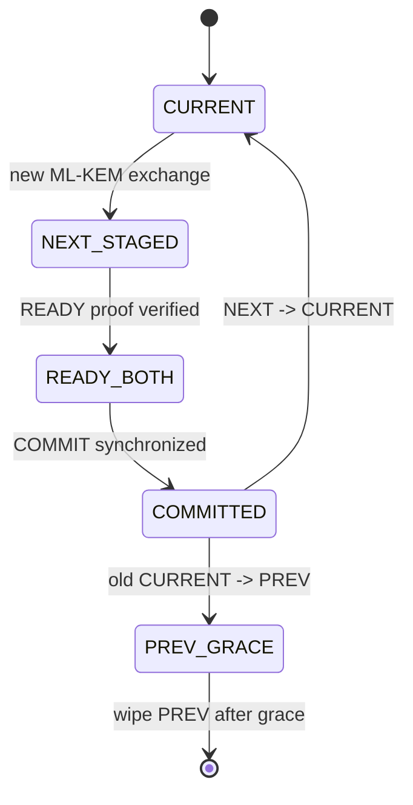

`pqc_hs_stage_next_key()` không đổi encrypt key. `pqc_hs_promote_staged_key()` chỉ được gọi sau control proof. Nếu peer restart/mất COMMIT, keepalive state giúp phát hiện mismatch và retry thay vì âm thầm dùng hai CURRENT khác nhau.

### 34.6 Reload

`sig_pqc_prepare_reload()` đánh dấu/reconcile binding; `sig_pqc_finalize_reload()` dừng worker policy không còn active và wipe state. `fwd_crypto_snapshot_active_to_prev()` giữ context cũ 3 giây để packet wire cũ đang bay vẫn decrypt được. Đây là hai grace khác nhau: config-context grace 3 giây và key PREV grace khoảng 90 giây.

## 35. Phân tích sâu config và `main.c`

### 35.1 `config_validate()`

Đây là nơi bảo vệ invariant trước dataplane. Mọi feature topology mới cần validation ở đây hoặc interface preflight, không nên chờ packet path phát hiện. Cần kiểm tra index range, duplicate ifname, bridge ownership, WAN dataplane mapping, policy IDs và active profile assumptions.

### 35.2 Policy matcher

`config_select_crypto_policy()` đi theo `profile.policy_indices`, nên thứ tự/priority được DB loader chuẩn bị là behavior. `crypto_policy_match_packet()` xử lý protocol, CIDR negate và port ranges.

Inbound matcher dùng packed `pol_in_match` cache để giảm dereference. `config_refresh_policy_in_any()` phải được gọi sau mọi thay đổi policy; nếu quên, fast-path skip flag có thể stale.

### 35.3 Quyết định hot reload hay restart

`main.c` so config theo nhiều tầng:

- toàn bộ giống: log no-update;
- LAN/WAN topology giống, policy/tuning đổi tương thích: hot reload;
- interface/profile identity/topology đổi: stop và full start;
- load/validate fail: blank daemon.

Khi thêm field config mới, phải đưa field đó vào đúng comparator. Nếu bỏ sót, thay đổi DB có thể bị xem là no-op; nếu xếp sai, một tuning nhỏ có thể gây full dataplane outage.

### 35.4 Lifetime của hai config slot

Runtime dùng các config storage riêng để forwarder luôn trỏ vào memory ổn định trong reload. Không được tạo `app_config` trên stack rồi gán `fwd->cfg` nếu stack có thể hết lifetime.

## 36. Phân tích sâu ARP, MAC và failover

### 36.1 `arp_bridge_from_local()`

Hàm consume packet, học source MAC gắn LAN, tìm profile/bridge, chọn primary WAN nếu usable hoặc backup WAN, encrypt ARP rồi enqueue. ARP không đi SWRR data vì broadcast/control semantics khác TCP/UDP.

### 36.2 `arp_bridge_from_wan()`

Xác định ingress WAN/profile, decrypt NE-ARP, học/relay metadata, rồi:

- unicast: tìm MAC/LAN hợp lệ;
- broadcast request: clone/flood tới profile LANs;
- tránh relay ngược packet vừa phát bằng stamp cache.

Flood cần clone buffer cho mọi destination trừ owner cuối. Khi thay logic flood phải kiểm tra từng clone failure và không reuse một address ở hai rings.

### 36.3 `mac_learn.c`

FDB là bridge decision, không phải authorization thay reverse-policy. Policy pass trước, FDB chỉ chọn output LAN. Persist file là operational state, không phải source of truth vĩnh viễn; restore vẫn lọc interface/MAC không còn hợp lệ.

### 36.4 `cfm_monitor_thread()`

Thread raw socket phát CCM và poll reply. `notify_is_up()` chỉ publish sau confirm counters để tránh flapping. CFM traffic được BPF pass lên kernel; nếu sửa BPF redirect `0x8902`, failover sẽ báo down dù link data vẫn tốt.

### 36.5 `wan_admin_kick/restore()`

KICK phải theo thứ tự: admin hold → ngừng new traffic/drain → detach/unplumb. RESTORE: plumb XSK → attach XDP/map → mark live → clear hold → ramp. Đảo thứ tự có thể redirect packet vào XSKMAP chưa có socket hoặc schedule packet vào interface chưa sẵn sàng.

## 37. Runbook vận hành theo triệu chứng

### 37.1 Băng thông giảm nhưng tổng CPU còn rảnh

Kiểm tra theo thứ tự:

1. `packet.log`: RX/XDP drop có tăng không.
2. `crypto_ring_drop` theo worker: một sticky worker có nghẽn riêng không.
3. `mid_to_wan` depth/TX full: link hoặc TX queue có đầy không.
4. UMEM/jumbo free: có leak/held pressure không.
5. CFM/admin/live state: một WAN có bị loại khiến traffic dồn sang link còn lại không.
6. Reorder gap/overflow/eviction.
7. Sau cùng mới xem aggregate CPU và crypto cost.

### 37.2 UDP loss/reorder tăng

Phân biệt ba stage:

- Fragment chưa ghép: cần reassembly cause counters/auth timeout.
- Datagram đã ghép nhưng packet sequence lệch: xem reorder held/released/late/gap.
- TX/RX ring drop trước/ngoài hai engine: xem XDP/ring/TX counters.

Không tăng `NE_BOND_REORDER_US` nếu nguyên nhân là fragment timeout hoặc TX ring full.

### 37.3 TCP retransmit tăng

Xem `gap_skipped`, late và ring/XDP drop. Reorder engine áp dụng cho TCP dù filename là UDP. Nếu late tăng nhưng gap thấp, hai WAN skew vượt hold; nếu ring drop tăng, tăng hold không cứu packet đã mất.

### 37.4 MTU 9000 không chạy

Kiểm tra lần lượt:

1. LAN MTU <= mọi WAN dataplane MTU.
2. BPF program attach được section `xdp.frags` native mode.
3. Kernel/driver hỗ trợ XDP RX SG.
4. XSK bind `XDP_COPY|XDP_USE_SG` thành công trên mọi queue.
5. RX jumbo counter tăng và jumbo drop không tăng.
6. TX jumbo counter/CQ/pool hồi phục.

## 38. Checklist mở rộng code

### Thêm protocol mới

- BPF WAN redirect protocol/EtherType.
- `crypto_proto_classify()` và registry ops.
- Wire marker/version/overhead.
- Policy parser/matcher.
- Sequence/reorder nếu protocol cần ordering.
- Stats protocol bucket.
- Reverse-policy và test malformed/auth failure.

### Đổi wire header hoặc nonce

- Tăng wire version.
- Encode/decode cả hai đầu và quy định endian.
- Cập nhật overhead/MSS/UDP layout.
- Cập nhật BPF EtherType nếu đổi.
- Test CURRENT/NEXT/PREV decrypt.
- Có kế hoạch rolling upgrade hoặc chấp nhận simultaneous restart.

### Tăng số worker/CPU

- Sửa CPU arrays và validate affinity.
- Kiểm tra wire worker ID compatibility.
- Tính lại memory reassembly/reorder theo worker.
- Kiểm tra ring dimensions và TX slot mapping.
- Soak test imbalance per worker, không chỉ tổng throughput.

### Hỗ trợ nhiều active profile

- Loại bỏ assumptions `profiles[0]` và slot 0.
- Xây map local/WAN/wire policy → profile slot.
- Tách scheduler blend, reassembly table và ARP/FDB ownership theo profile.
- Sửa reload comparator/lifecycle.
- Test hai profile có trùng 5-tuple nhưng không trộn key/state.

### Thêm counter/log

- Fast path chỉ atomic increment; không format/string/file I/O per packet.
- Snapshot/delta/report trong `stats.c` maintenance path.
- Counter phải tách cause rõ ràng và không gom auth failure với queue full.
- Log key bằng ID/fingerprint, không ghi raw secret.

## 39. Tiêu chuẩn review trước khi merge

Một thay đổi dataplane chỉ nên merge khi trả lời được:

1. Hàm nào nhận ownership packet và mọi failure path có free đúng một lần không?
2. Thay đổi chạy trên RX, crypto, TX hay control thread? Có block/lock/I/O không?
3. Có làm một flow đổi worker, TX slot hoặc sequence semantics không?
4. Có đổi wire layout/overhead/MTU calculation không?
5. Peer phiên bản cũ xử lý packet mới thế nào?
6. Có bypass được auth/reverse-policy khi parse lỗi không?
7. Resource cap là gì và counter nào báo khi cap đầy?
8. Reload, WAN drain/restore và shutdown có cleanup state mới không?
9. Test 1500/9000 và ba topology được hỗ trợ đã chạy chưa?
10. Soak test có chứng minh pool/ring/table không leak và drop chỉ xuất hiện khi resource thật sự nghẽn không?

## 40. Bản đồ struct tổng thể

Các hàm chỉ là hành vi; các struct mới là nơi state của hệ thống tồn tại. Sơ đồ sau phân biệt ba loại quan hệ:

- `owns`: struct cha chứa trực tiếp và chịu trách nhiệm vòng đời.
- `points to`: chỉ giữ pointer; object đích phải sống lâu hơn.
- `references by index`: không có pointer, chỉ liên hệ qua index/ID.

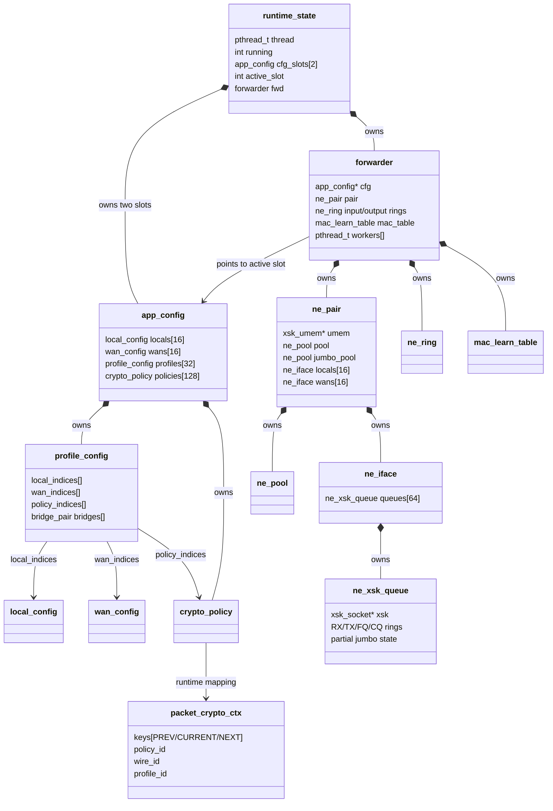

Quan hệ quan trọng nhất là `forwarder.cfg` **không sở hữu** config. Nó trỏ vào một trong hai `runtime_state.cfg_slots`. Vì dataplane thread liên tục dereference pointer này, slot đang active không được ghi đè tự do khi worker đang chạy.

## 41. Nhóm struct control plane

### 41.1 `struct runtime_state`

Định nghĩa trong `main.c`:

| Field | Ý nghĩa | Ai ghi | Ai đọc |
|---|---|---|---|
| `thread` | pthread chạy `forwarder_run()` | control thread | stop/join path |
| `has_thread` | thread đã được create và cần join | control thread | notification/shutdown |
| `running` | trạng thái runtime mức main | control + forwarder wrapper | apply/restart decision |
| `fwd` | toàn bộ active dataplane object | startup/cleanup | dataplane workers |
| `cfg_slots[2]` | double-buffer config | DB apply/reload | `fwd.cfg` và reload logic |
| `active_slot` | slot hiện được dataplane dùng | apply logic | chọn old/new config |

Double buffer giải quyết race “DB đang ghi config mới trong khi dataplane đọc config cũ”:

```text
active_slot = 0
fwd.cfg -----> cfg_slots[0]       // worker đang đọc
DB load ----> cfg_slots[1]        // control plane ghi slot inactive
validate/prepare
publish/apply
active_slot = 1
fwd.cfg -----> cfg_slots[1]
```

Khi thêm pointer động vào `app_config`, double buffer không còn tự động an toàn nếu hai slot cùng trỏ một allocation. Hiện các mảng nằm inline nên copy/lifetime đơn giản. Extension nên tiếp tục ưu tiên fixed-size inline data hoặc phải định nghĩa deep-copy/free rõ ràng.

### 41.2 `struct app_config`

Đây là snapshot cấu hình đã normalize từ DB, không phải DB model thô.

```text
app_config
 ├─ locals[local_count]              // tất cả LAN của active runtime
 ├─ wans[wan_count]                  // gồm dataplane và có thể non-dataplane
 ├─ profiles[profile_count]
 │    ├─ local_indices[] ───────────> app_config.locals[]
 │    ├─ wan_indices[] ─────────────> app_config.wans[]
 │    ├─ policy_indices[] ──────────> app_config.policies[]
 │    └─ bridges[].local_idx/wan_dp  // hai index space khác nhau
 └─ policies[policy_count]
```

Các field `bpf_file`, `bpf_wan_file`, fake EtherType và `crypto_enabled` là runtime-global. Profile không sở hữu copy của local/WAN/policy; nó tham chiếu bằng index.

Các hàm liên quan:

- `config_load_from_db()` tạo toàn snapshot.
- `config_validate()` kiểm tra quan hệ index và invariant.
- `config_apply_crypto_from_policies()` suy ra crypto global state.
- `forwarder_init()` chỉ giữ pointer và chuyển snapshot thành runtime resources.
- main comparator quyết định snapshot mới được hot-apply hay cần restart.

### 41.3 `struct profile_config`

`profile_config` là graph liên kết các mảng trong `app_config`:

| Nhóm field | Logic sử dụng |
|---|---|
| `id`, `name`, `enabled` | Identity và active check |
| `local_indices[]` | LAN nào được policy/profile sở hữu |
| `wan_indices[]` | WAN config nào nằm trong pool |
| `wan_bandwidth_weight[]` | Trọng số song song với `wan_indices[]` |
| `policy_indices[]` | Thứ tự matcher policy |
| `bridges[]` | Mapping LAN config index sang WAN dataplane index |
| `policy_in_any` | Cached inbound fast-path flag |
| PQC fingerprints/role/pub | Bind policy handshake identity |

Hai array `wan_indices[i]` và `wan_bandwidth_weight[i]` là một cặp; không được sort/chèn một array mà quên array kia. Tương tự, `policy_indices[]` quyết định thứ tự ưu tiên thực tế nên DB loader phải tạo đúng thứ tự.

### 41.4 `struct crypto_policy`

Một policy có ba identity khác nhau:

- `db_id`: primary key PostgreSQL, dùng operator/reload/handshake.
- `id`: wire ID 8-bit ghi vào encrypted packet.
- array index `pi = cp - cfg->policies`: dùng truy cập context runtime.

```mermaid
flowchart LR
    DBID[db_id<br/>operator/DB] --> CP[crypto_policy]
    CP --> WID[id / wire_id<br/>1 byte on wire]
    CP --> PI[array index<br/>runtime context index]
    WID --> MAP[policy_index_by_wire_id[256]]
    MAP --> CTX[packet_crypto_ctx array]
```

Không dùng lẫn ba giá trị. Đặc biệt `packet_crypto_ctx.policy_id` đang lưu DB policy ID còn `packet_crypto_ctx.wire_id` mới là byte trên wire.

CIDR được lưu dưới dạng network+mask; `src_any/dst_any`, negate flags và port range đã normalize. Fast path không đọc string DB.

### 41.5 Các index space trong dự án

Đây là nguồn bug phổ biến nhất:

| Tên | Phạm vi | Đại diện |
|---|---|---|
| `cfg_local_idx` | `app_config.locals[]` | LAN row/config index |
| `pair_local_idx` hoặc `fwd_local_idx` | `forwarder.locals[]`, `ne_pair.locals[]` | LAN đang plumb/live |
| `cfg_wan_idx` | `app_config.wans[]` | WAN row, có thể không dataplane |
| `wan_dp` | `forwarder.wans[]`, `ne_pair.wans[]` | WAN dataplane compact index |
| `profile_pi` | `app_config.profiles[]` | array position, không phải profile DB ID |
| `profile_id` | DB identity | giá trị bền qua reload |
| `policy_index` | `app_config.policies[]` | runtime array position |
| `policy_id/db_id` | DB identity | handshake/operator |
| `wire_id` | 0..255 | packet wire identity |
| `worker_idx` | 0..`NE_CRYPTO_WORKERS-1` | crypto state shard |
| `tx_slot` | 0..active TX slots-1 | output ring/TX consumer |
| `queue_id` | NIC RX/TX hardware queue | XSKMAP key |

Các hàm chuyển đổi bắt buộc:

- `config_wan_cfg_to_dp()` / `config_wan_dp_to_cfg()`.
- `mac_fwd_local_for_cfg_idx()`.
- `fwd_wan_live_dp_for_cfg()`.
- `profile_pi_for_wire_policy()`.
- `dp_crypto_worker_idx_for_cpu()` chỉ dùng compatibility CPU-ID, không thay worker mapping chung.

## 42. `struct forwarder`: runtime object trung tâm

`forwarder` không xử lý packet trực tiếp; nó gom mọi object mà packet path cần.

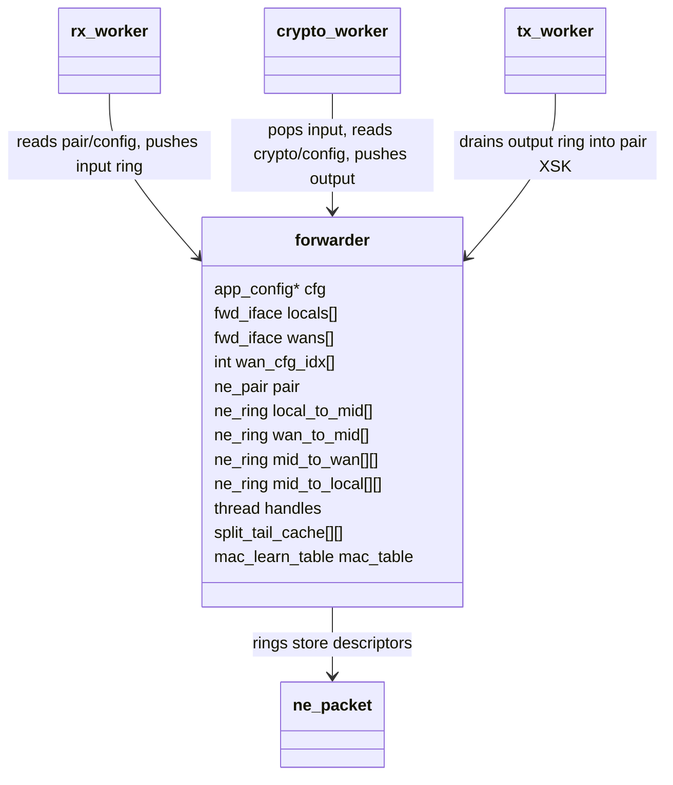

### 42.1 Interface metadata kép

`fwd_iface` chỉ có ifindex/ifname, dùng mapping logic. `ne_iface` có XSK queues và driver state. Cùng một physical NIC xuất hiện ở cả hai:

```text
fwd.wans[wan_dp]        = logical identity/mapping
fwd.pair.wans[wan_dp]   = AF_XDP runtime resource
fwd.wan_cfg_idx[wan_dp] = link về cfg.wans[cfg_wan_idx]
```

Ba array phải đồng bộ index. Hot add/remove phải reconcile cả metadata lẫn `pair.*_live`.

### 42.2 Ring matrix

```text
local_to_mid[worker]              LAN RX producers -> one crypto worker
wan_to_mid[worker]                WAN RX producers -> one crypto worker
mid_to_wan[wan_dp][tx_slot]       RX/crypto producers -> one TX slot
mid_to_local[local_idx][tx_slot]  crypto/bypass producers -> one TX slot
```

Tên chiều thứ hai trong output ring từng được gọi worker/ring index, nhưng consumer thực tế là TX slot. `dp_out_ring_bind()` chọn TLS output index. Khi `NE_CRYPTO_WORKERS != NE_TX_SLOTS`, không được mặc định index worker chính là TX slot; code sử dụng `tx_slot`/modulo mapping.

### 42.3 Split-tail cache

`split_tail_cache[worker][64]` chứa address jumbo đã allocate nhưng chưa có packet. Nó thuộc crypto worker tương ứng, không cần lock. `split_tail_count` là stack pointer. Cache giảm pool lock khi UDP split ở tốc độ cao nhưng làm giảm `jumbo_free` ngay cả khi chưa có fragment pending; stats/runbook phải hiểu đây là reservation hợp lệ.

## 43. Nhóm struct AF_XDP và packet ownership

### 43.1 `struct ne_packet`

`ne_packet` chỉ là descriptor 16 byte gần đúng, không chứa payload:

| Field | Ý nghĩa |
|---|---|
| `addr` | UMEM offset hoặc jumbo index có high-bit flag |
| `len` | số byte frame hợp lệ |
| `dir` | destination semantic `LOCAL` hay `WAN` |
| `wan_idx` | ingress/egress WAN dataplane index tùy stage |
| `local_idx` | ingress/egress forwarder-local index |
| `tx_slot` | TX consumer affinity được chọn trước |

`dir`, `wan_idx`, `local_idx` không phải tất cả đều có nghĩa ở mọi stage. Ví dụ LAN RX set `local_idx`; scheduler sau đó set `wan_idx` và `dir=NE_DIR_WAN`. WAN decrypt giữ `wan_idx` làm ingress context đến khi bridge xong.

### 43.2 Trạng thái packet qua pipeline

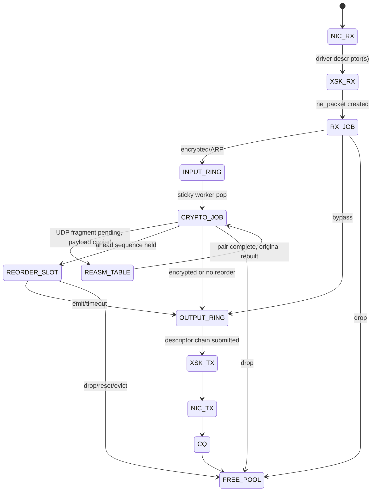

### 43.3 `struct ne_ring`

Ring chứa bản copy `ne_packet`, còn payload nằm trong pool. `head` là producer publish position, `tail` là consumer position; `mask=cap-1` yêu cầu power-of-two. Hai spinlock tách push/pop để nhiều producer và một/nhiều consumer không tranh cùng cache line.

Mối liên hệ hàm:

- `ne_ring_init/destroy()` sở hữu `buf` và locks.
- `ne_ring_try_push/pair()` chuyển ownership descriptor khi thành công.
- `ne_ring_try_pop()` chuyển ownership sang caller.
- `dp_ring_push()` bọc push+stats+wakeup và tự free khi lỗi.
- TX drain pop ring rồi chuyển payload ownership sang NIC/CQ.

### 43.4 `struct ne_pool`

Pool là ring address tự do có spinlock. Nó không biết nội dung packet. Có hai instance trong `ne_pair`:

- `pool`: UMEM chunk addresses dùng RX FQ/TX descriptors.
- `jumbo_pool`: indexes của linear buffers userspace.

Pool head/tail chỉ quản lý availability, không phải packet ordering. Nếu một address bị push hai lần, hai packet có thể cùng ghi một buffer; nếu quên push, soak test sẽ thấy free count giảm.

### 43.5 `struct ne_xsk_queue`

Một queue gom bốn ring libxdp và state multi-buffer:

- RX: kernel/driver → userspace.
- FQ: userspace cấp free UMEM frames cho RX.
- TX: userspace → driver.
- CQ: driver trả TX frames đã dùng.
- `rx_pending`: descriptors vừa peek, chờ release.
- `rx_recycle[]`: original chunks của jumbo chain cần trả pool.
- `rx_partial_*`: jumbo chain chưa gặp segment cuối.

State partial thuộc queue, vì XDP fragment descriptors của một packet không được ghép giữa hai hardware queues.

### 43.6 `struct ne_iface` và `struct ne_pair`

`ne_iface` là một NIC với tối đa 64 `ne_xsk_queue`. `ne_pair` là container chung cho tất cả LAN/WAN, UMEM, BPF objects, live flags và counters.

Shared UMEM nghĩa là address có thể đi từ LAN XSK RX, qua userspace, rồi được submit trên WAN XSK TX mà không cần một pool riêng theo interface. Với jumbo linear buffer vẫn phải copy thành UMEM chunks ở TX.

`xdp_local_on/wan_on` nói BPF attach state; `local_live/wan_live` nói dataplane socket usable. Hai trạng thái khác nhau trong quá trình plumb/rollback và phải được publish theo đúng thứ tự.

## 44. Nhóm struct flow, scheduler và ordering

Có ba bảng flow độc lập vì chúng giải quyết ba câu hỏi khác nhau:

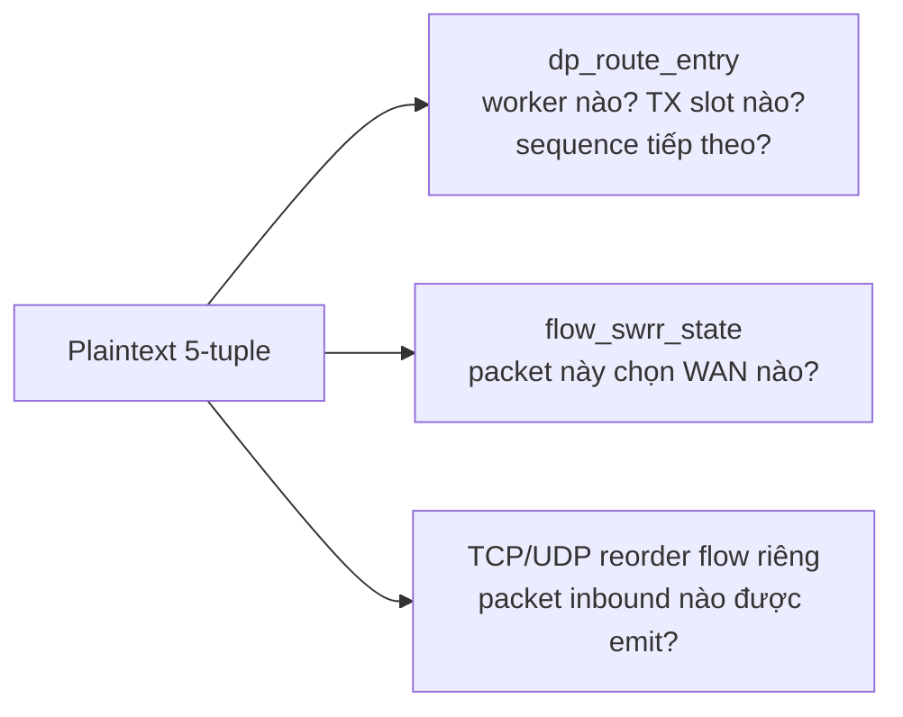

Không nên gộp chúng chỉ vì đều dùng 5-tuple. Lifetime, concurrency và key semantics khác nhau.

### 44.1 `struct flow_key` và `flow_swrr_state`

`flow_key` giữ 5-tuple. `normalize_flow_5tuple()` biến hai chiều thành cùng canonical key. `flow_swrr_state` thêm:

- danh sách WAN pool tại lần dùng gần nhất;
- `current[]` accumulator của smooth WRR;
- `wan_count` và `tie_start`;
- `stamp` cho replacement;
- `valid` publication flag.

Table là thread-local (`g_flow_swrr`), nên không lock. Khi WAN pool thay đổi, `flow_swrr_pool_same()` fail và state được reset với pool mới. Weight không lưu trong struct; weight hiện tại được truyền mỗi lần pick, cho phép blend/ramp runtime.

### 44.2 `dp_route_key`, `dp_route_entry`, `dp_flow_route`

`dp_route_key` canonicalize endpoints nhưng không chứa direction. Direction được tính riêng 0/1 để index hai counter arrays.

`dp_route_entry` chứa:

- canonical key;
- `tcp_tx_seq[2]`, `udp_tx_seq[2]` atomic;
- sticky `worker_idx`;
- sticky `tx_slot`;
- atomic `valid` publish flag.

Table route là process-wide vì LAN và WAN thread đều cần tìm cùng assignment. Insert có lock ngắn; sequence increment atomic. `dp_flow_route` chỉ là value nhỏ trả từ lookup để caller không giữ pointer vào shared entry.

`dp_udp_seq_fallback` là TLS fallback khi route table path không dùng được/collision. Tên chứa UDP nhưng có cả `tcp_next_seq[2]`. Đây là degraded state path, không nên trở thành primary design.

### 44.3 `dp_bond_reorder_key`, item và callbacks

`dp_bond_reorder_key` giữ **directional** plaintext tuple. Không canonicalize vì inbound direction cần một sequence stream riêng.

`dp_bond_reorder_item` bọc `ne_packet` với:

- `profile_pi`: để emit còn kiểm tra/forward đúng profile;
- `ingress_wan_dp`: FDB miss có thể fallback bridge theo đường gói vào.

`dp_bond_reorder_ops` đảo dependency: generic reorder engine không include `forwarder`; WAN ingress truyền `ctx=fwd`, `emit` và `drop` callbacks. Nhờ đó reorder state chỉ biết thứ tự, còn bridge/free/stats thuộc dataplane.

### 44.4 `reorder_engine`, `reorder_flow` và `reorder_slot`

`reorder_flow` giữ state điều khiển:

- key + epoch;
- `next_seq` cần emit;
- gap/last-seen time;
- replacement stamp;
- số held.

`reorder_slot` giữ data-plane ownership: một `dp_bond_reorder_item`, exact
`seq`, `valid`. Index vật lý là `seq % 4096`, nhưng exact `slot.seq` bắt buộc
kiểm tra để phát hiện collision/wrap. `reorder_engine` sở hữu worker shards và
counter của đúng một protocol; hai instance TCP/UDP không chia sẻ allocation.

Mỗi crypto worker có một shard riêng của cả flow và slots. Quan hệ worker được giữ từ wire core ID → WAN RX route → crypto worker → reorder shard.

## 45. Nhóm struct crypto dataplane

### 45.1 `struct packet_crypto_ctx`

Đây là bridge giữa handshake/control plane và packet crypto:

| Field | Ý nghĩa |
|---|---|
| `master_key` | static/base key input; với PQC không nên coi là active traffic key |
| `keys[3][32]` | PREV, CURRENT, NEXT |
| `initialized` | context cấu trúc đã dựng |
| `policy_id` | DB policy identity |
| `wire_id` | one-byte packet policy identity |
| `profile_id` | profile DB identity |
| `pqc_from_handshake` | key slots phải refresh từ PQC registry |
| `pqc_key_in_use_ms` | mốc 30-day lifetime của CURRENT |
| `pqc_timed_key` | bản nhận dạng key đang được tính tuổi |
| `pqc_rekey_sent` | chống gửi request rekey lặp |

`initialized=true` không đồng nghĩa CURRENT key usable. Packet path còn gọi `fwd_crypto_policy_ready()` và `crypto_pqc_sess_load()` kiểm tra key khác zero.

Quan hệ copy:

```text
PQC policy_key_binding.keys[]
       │ sig_pqc_get_keys()
       v
policy_crypto_ctx[policy_index]             // master runtime copy
       │ generation + memcpy
       v
worker_policy_crypto_ctx[worker][policy]    // immutable fast-path copy
       │ pointer returned
       v
crypto_pqc_sess.key                         // non-owning view for one operation
```

### 45.2 `crypto_pqc_sess_t`

Session chỉ giữ pointer `key`, pointer `aad`, `aad_len`; không sở hữu bytes. Nó có lifetime rất ngắn trong encrypt/decrypt. Không lưu session pointer qua reload/generation update.

### 45.3 `struct crypto_option_ops`

Đây là vtable theo option/protocol:

```text
registry[CRYPTO_OPT_L2_PQC][CRYPTO_PROTO_UDP]
  -> need_split
  -> split
  -> encrypt/decrypt
  -> is_fragment/reasm/frag_gc
```

TCP/ICMP/OSPF/ARP dùng ops không fragmentation; UDP cung cấp đủ callbacks. Router kiểm tra callback NULL trước khi dispatch. Khi thêm option mới, implementation state không nên đặt vào vtable object nếu cần per-worker isolation; vtable nên bất biến, state để TLS/table riêng.

### 45.4 TLS crypto metadata không nằm trong struct packet

Epoch/sequence/datagram ID được truyền gián tiếp qua TLS trong `crypto_option_router.c`:

```text
dp_*_next_tx_seq()
 -> crypto_option_*_set_tx_seq()
 -> pqc_l2_tcp/udp encrypt đọc TLS và ghi wire shim

pqc_l2_tcp/udp decrypt xác thực wire shim
 -> crypto_option_*_set_rx_meta()
 -> wan_ingress take_rx_meta()
 -> reorder item
```

Vì metadata là TLS, `set` và `encrypt` hoặc `decrypt` và `take` phải chạy cùng OS thread, không được enqueue sang worker khác ở giữa. Hàm clear trước decrypt ngăn metadata packet trước bị tái sử dụng nếu packet mới fail sớm.

### 45.5 UDP fragment layout và reassembly structs

`crypto_pqc_udp_frag_layout` là value object chỉ chứa bốn length sau khi tính. Nó không sở hữu buffer.

Internal `opt_entry` sở hữu bản copy plaintext của hai phần:

```text
opt_entry
 ├─ identity: epoch + datagram_id + bond_seq
 ├─ first[9000]  + first_len  + got_first
 ├─ second[9000] + second_len + got_second
 ├─ original Ethernet prefix + eth_len
 └─ timestamp_ns
```

`opt_table` có 512 entries và GC cursor. `g_tables[profile_slot][worker]` chỉ cấp table khi fragment đầu tiên xuất hiện. Vì pointer table tồn tại toàn process, reload/profile reuse cần cẩn thận không để fragment state profile cũ ghép vào profile mới; epoch/key authentication và GC giảm rủi ro nhưng lifecycle reset rõ ràng vẫn tốt hơn.

## 46. Nhóm struct PQC handshake

### 46.1 `identity_entry_t`

Registry entry map fingerprint ngắn tới `priv_key`/`pub_key` pointers đã cấp phát. Registry sở hữu key strings trong RAM và phải wipe/free đúng lúc. Fingerprint là lookup identity, không phải traffic key ID.

### 46.2 `policy_key_binding_t`

Đây là struct state machine lớn nhất dự án, một instance cho mỗi bound policy. Có thể chia field thành sáu nhóm:

| Nhóm | Field tiêu biểu | Hàm sử dụng |
|---|---|---|
| Identity/config | policy/profile IDs, role, peer IP, fingerprints, WAN | bind/start worker |
| Key slots | `keys`, `key_ids`, valid flags, encrypt/decrypt key | handshake success, stage/promote, get keys |
| Time/liveness | last sent/recv, keepalive epoch/seq, retry/grace times | worker loop, keepalive verify |
| RX queue | pointers, lengths, source info, head/tail, mutex/cond | dispatcher/feed/worker recv |
| Idempotency | four `hs_cache` entries, next index | responder duplicate HELLO |
| State flags | ready, started, give-up, poke, rekey, exit | supervisor/operator/reload |

Khóa có hai tầng:

- global `g_key_mutex` bảo vệ binding registry/key state xuyên policy;
- mỗi binding `rx_mutex`/`rx_cond` bảo vệ queue của policy.

Không giữ `g_key_mutex` trong lúc chờ network/condition; worker start helper được thiết kế để create nhanh và state machines độc lập.

### 46.3 `pqc_rx_pkt_info_t` và RX queue

Dispatcher allocate/copy UDP payload vào `rx_queue[16]`, kèm length và source address/MAC. Worker pop, xử lý rồi free payload. Queue full phải drop một handshake message nhưng retry/idempotent cache cho phép phục hồi; đây không phải data packet queue.

### 46.4 `pqc_hs_cache_entry_t`

Responder cache:

- hash HELLO và session ID;
- serialized response;
- derived master key;
- promotion/commit flags.

Nếu cùng HELLO retransmit, responder gửi đúng response cũ thay vì encapsulate lại thành secret mới. Đây là điều kiện để packet loss handshake không làm hai phía giữ hai key khác nhau.

### 46.5 `struct pqc_hs_msg`

Đây là packed wire header:

```text
magic | msg_type | session_id | policy_id | sig_len | data_len | payload...
```

Packed struct không có padding nhưng integer endian phải được encode/decode nhất quán. `payload[0]` chứa data rồi signature theo lengths; mọi parser phải validate tổng length trước khi lấy pointer. Không cast untrusted buffer rồi đọc payload trước `pqc_hs_validate_message()`.

## 47. Nhóm struct ARP, MAC và failover

### 47.1 `mac_learn_entry` và `mac_learn_table`

`mac_learn_entry` chỉ map client MAC → LAN ifname. Dùng ifname thay index giúp persist qua restart/index reorder.

`mac_learn_table` chứa:

- dense `list[256]` để persist/log/iterate;
- `hash_head[256]` và `hash_next[256]` tạo chained hash bằng index;
- cached appliance LAN MACs để không học chính mình;
- spinlock vì ARP có thể đến từ nhiều crypto/RX context.

Khi list thay đổi, `hash_rebuild_locked()` phải giữ hai representation đồng bộ. Không chỉnh `list` trực tiếp ngoài table helpers.

### 47.2 `bridge_pair`

Bridge pair nằm trong profile nhưng nối hai index space: `local_idx` là config LAN index; `wan_dp` là dataplane WAN index. `ifname` là bridge identity dùng log/CFM. Hot topology thay đổi phải rebuild mapping nếu compact WAN index đổi.

### 47.3 `cfm_link_t`

Mỗi monitored WAN có một `cfm_link_t`:

- raw socket/ifindex/local MAC;
- learned remote MAC;
- local/remote MEP IDs và TX sequence;
- RX diagnostic counters;
- last receive, consecutive success/fail, `is_up`;
- cfg WAN index và dataplane WAN index;
- mutex riêng.

CFM thread là writer chính. Status IPC và unified MAC log lấy snapshot dưới link mutex. Callback chỉ truyền `wan_dp`, ifname và transition; scheduler/failover không giữ pointer lâu dài vào `cfm_link_t`.

### 47.4 `cfm_wan_snap`

Đây là DTO snapshot để `mac_learn.c` in bảng thống nhất mà không phụ thuộc internal CFM struct/lock. Pattern snapshot này nên dùng khi subsystem khác chỉ cần đọc một phần state.

### 47.5 Scheduler state structs

`wan_drain_slot`, `wan_join_ramp`, `wan_weight_blend` là state machines theo thời gian monotonic:

- drain giữ legacy cfg WAN identity vì config mới có thể đã bỏ WAN;
- join giữ target weight;
- blend giữ cặp old/new weight cho toàn profile.

Chúng là global arrays hiện gắn active profile slot 0. Muốn multi-profile phải đưa chúng vào runtime/profile-owned container hoặc index đúng profile, không chỉ tăng array loop.

## 48. Nhóm struct stats và observability

### 48.1 `traffic_counter`

Mỗi bucket có atomic packets/bytes. Packet path chỉ increment relaxed atomic; không lock và không file I/O.

### 48.2 `dp_snapshot`

Snapshot là bản giá trị tổng hợp tại một thời điểm:

- traffic tensor direction × protocol × MTU;
- RX/TX byte totals;
- drop cause totals;
- jumbo/XDP statistics;
- hai snapshot `tcp_reorder` và `udp_reorder` kiểu `dp_bond_reorder_stats`.

Nó không chứa pointer về live counters nên sau capture có thể format dưới report lock mà không giữ dataplane lock.

### 48.3 `report_window`

Mỗi window giữ period, last timestamp và previous cumulative snapshot. Report tính `current - previous`, sau đó thay previous. Vì mỗi window có previous riêng nên 10m/30m/1h/1d không ảnh hưởng nhau.

Khi thêm counter mới cần:

1. atomic live counter;
2. field trong `dp_snapshot`;
3. load/sum trong `capture_snapshot()`;
4. delta/format trong `emit_report()`;
5. nếu cần, public increment API trong header.

Thiếu một bước sẽ tạo counter luôn 0 hoặc cumulative thay vì window delta.

## 49. Ma trận struct ↔ hàm ↔ thread ↔ vòng đời

| Struct/state | Tạo/reset | Hàm đọc/ghi chính | Thread truy cập | Hủy/cleanup |
|---|---|---|---|---|
| `runtime_state` | `main()` calloc | apply/load/stop helpers | control thread | main shutdown free |
| `app_config` | `config_load_from_db()` | matchers, scheduler, forwarder | control + mọi dataplane reader | slot reuse sau quiesce/apply |
| `forwarder` | `forwarder_init()` | toàn bộ core | control tạo; workers dùng | `forwarder_cleanup()` |
| `ne_pair` | `ne_pair_open()` | RX/TX/memory helpers | RX/crypto/TX/admin | `ne_pair_close()` |
| `ne_ring` | `ne_ring_init()` | producer/consumer stages | nhiều threads | `ne_ring_destroy()` sau join |
| `ne_xsk_queue` | open/plumb helpers | recv/refill/TX/CQ | assigned RX/TX + admin under lock | unplumb/close |
| `flow_swrr_state` | TLS calloc/reset | flow table pick | owning RX/crypto thread | thread cleanup |
| `dp_route_entry` | lazy insert | worker/TX pick, seq increment | shared RX/crypto | process lifetime/currently no full reset |
| TCP reorder flow/slot | lazy allocation/lookup/reset | WAN crypto worker shard | one worker + stats read | reset worker/GC |
| UDP reorder flow/slot | lazy allocation/lookup/reset | WAN crypto worker shard | one worker + stats read | reset worker/GC |
| `packet_crypto_ctx` master | `fwd_crypto_rebuild()` | sync/key tick/get by wire | control/handshake + generation copy | rebuild/reset/wipe |
| worker crypto ctx | generation memcpy | PQC L2 option | owning crypto worker | next rebuild/process exit |
| `opt_table/opt_entry` | lazy calloc on UDP fragment | UDP reasm/GC | owning crypto worker shard | process lifetime/currently no explicit free |
| `policy_key_binding_t` | bind policy | dispatcher/worker/reload/API | PQC threads + control | finalize reload/process cleanup |
| `mac_learn_table` | bootstrap/restore | ARP learn/FDB lookup/tick | dataplane + maintenance | persist/shutdown |
| `cfm_link_t` | `cfm_init()` | monitor/status/callback | CFM + IPC readers | `cfm_cleanup()` |
| stats atomics | `ne_dp_stats_init()` | increment/capture | mọi dataplane + TX0 reporter | process lifetime |

## 50. Quan hệ struct-hàm qua một packet UDP split hoàn chỉnh

Ví dụ này nối toàn bộ mô hình dữ liệu với hàm:

1. Driver ghi ba XDP descriptors vào `ne_xsk_queue.rx` nếu LAN frame jumbo.
2. `recv_queue()` dùng `rx_partial_*`, cấp address từ `ne_pair.jumbo_pool`, tạo một `ne_packet`.
3. `local_rx_thread()` đọc `forwarder.cfg` để classify, dùng `dp_route_entry` lấy worker/TX slot rồi copy descriptor vào `forwarder.local_to_mid[worker]`.
4. Crypto worker pop `ne_packet`; `pick_profile_policy()` đi từ `profile_config.policy_indices` tới `crypto_policy`.
5. `fwd_wan_pick_for_local()` dùng profile WAN arrays và TLS `flow_swrr_state` chọn cfg WAN, rồi map sang `wan_dp`.
6. `dp_udp_next_tx_seq()` tăng `dp_route_entry.udp_tx_seq[direction]`.
7. `fwd_crypto_policy_ctx()` trả pointer tới worker `packet_crypto_ctx`.
8. `crypto_option_udp_set_tx_seq()` đặt TLS metadata; `pqc_l2_udp.c` đọc metadata.
9. Layout helper tạo `crypto_pqc_udp_frag_layout`; split-tail cache cấp `ne_packet` thứ hai.
10. Hai lần GCM dùng cùng CURRENT key trong context nhưng nonce riêng; shim có cùng epoch/seq/datagram ID.
11. `ne_ring_try_push_pair()` đưa hai descriptors vào `mid_to_wan[wan_dp][tx_slot]` cùng transaction.
12. TX worker pop; `tx_drain_queue()` chuyển mỗi jumbo linear `ne_packet` thành UMEM descriptor chains trong `ne_xsk_queue.tx`.
13. Peer WAN RX tạo hai `ne_packet`, đọc wire worker ID và đưa cùng `wan_to_mid[worker]`.
14. `opt_table[profile_slot][worker]` nhận hai phần vào cùng `opt_entry`; `opt_emit_join()` tạo frame gốc.
15. Decrypt publish epoch/seq TLS; reverse-policy dùng `profile_config`/`crypto_policy`.
16. `dp_bond_reorder_item` bọc packet, profile và ingress WAN; UDP submit đưa nó vào UDP engine riêng.
17. Emit callback dùng `mac_learn_table` chọn LAN và push `mid_to_local[local][tx_slot]`.
18. LAN TX submit UMEM descriptors; CQ trả addresses về `ne_pair.pool`.

Nếu một bước fail, owner hiện tại phải free hoặc chuyển cho drop callback. Đây là chuỗi nên dùng khi review leak/double-free hoặc thêm metadata mới.

## 51. Quy tắc thiết kế struct mới

Khi mở rộng dự án, trước khi thêm struct/field hãy xác định:

1. **Owner:** object nào chứa hoặc cấp phát nó?
2. **Lifetime:** process, active profile, interface, worker, flow hay packet?
3. **Concurrency:** một writer, shard theo worker, TLS hay shared atomic/lock?
4. **Identity:** pointer, DB ID, wire ID hay runtime index?
5. **Copy semantics:** `memcpy` an toàn hay cần deep copy?
6. **Reload:** giữ qua reload, migrate hay reset/drop?
7. **Cleanup:** free/wipe ở hàm nào và sau thread nào join?
8. **Observability:** cap/full/collision/timeout được counter nào phản ánh?

Gợi ý placement:

- State chỉ dùng trong một worker: TLS hoặc `array[worker]`, tránh global lock.
- State gắn active dataplane: field của `forwarder` hoặc subsystem object do forwarder sở hữu.
- State gắn config snapshot: inline trong `app_config`, không trỏ memory tạm của libpq.
- State wire protocol: packed/value struct với version và explicit endian.
- State đọc chéo subsystem: cung cấp snapshot DTO, không expose internal mutable pointer.
- Secret/key: owner rõ ràng, wipe khi hết lifetime, không đưa vào generic log/snapshot.

## 52. Lịch sử chia per-packet sau khi bỏ `window_kb`

> Phần 52 mô tả thiết kế SWRR per-packet của commit `0962f45` để phục vụ
> đối chiếu lịch sử. Thiết kế hiện hành đã chuyển sang per-connect byte window;
> xem phần 53. Các câu dùng từ “hiện tại” trong phần 52 chỉ thuộc thời điểm của
> thiết kế cũ này.

### 52.1 `window_kb` cũ làm gì

Logic cũ giữ một flow trên `current_wan` cho đến khi `byte_count` đạt quota `window_kb`, sau đó mới chuyển sang WAN kế tiếp theo weight. Ví dụ window 256 KB:

```text
WAN0: gửi liên tục khoảng 256 KB
WAN1: gửi liên tục khoảng 256 KB
WAN0: gửi tiếp 256 KB
...
```

Nó vẫn cho một connection dùng nhiều WAN theo thời gian, nhưng **không phải per-packet thực sự**. Ở 10 Gbit/s, một block hàng trăm KB được phát rất nhanh nhưng tạo burst lớn trên từng đường. Packet đầu block WAN1 có thể tới trước packet cuối block WAN0 hoặc ngược lại, tạo gap/reorder theo block. Flow table cũ còn có bucket locks, byte counter, current WAN, drain timestamp và GC nên fast path nặng hơn.

Commit `0962f45` bỏ `flow_entry.byte_count`, `current_wan`, `wan_window_sizes` và thay bằng Smooth Weighted Round Robin (SWRR) cập nhật ở **mỗi packet**.

### 52.2 Call graph chọn WAN hiện tại

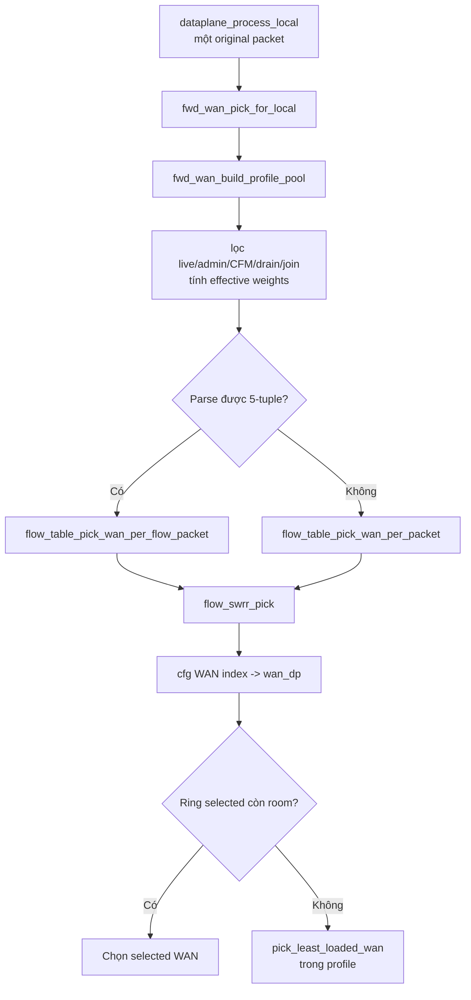

Hàm chọn WAN được gọi đúng một lần cho mỗi original LAN packet, trước mã hóa/split. Vì vậy:

- TCP packet 1 có thể WAN0, packet 2 WAN1, packet 3 WAN0.
- UDP datagram nguyên chọn một WAN.
- UDP datagram bị chia hai NE fragments vẫn gửi **cả hai fragment trên cùng WAN** bằng `ne_ring_try_push_pair()`. Per-packet ở đây tính theo original packet/datagram, không tách hai fragments của cùng datagram sang hai WAN.

### 52.3 State `flow_swrr_state`

Mỗi flow có:

```c
struct flow_swrr_state {
    struct flow_key key;
    int wans[MAX_INTERFACES];
    int64_t current[MAX_INTERFACES];
    uint64_t stamp;
    uint8_t wan_count;
    uint8_t tie_start;
    uint8_t valid;
};
```

- `key`: canonical 5-tuple nhận diện connection.
- `wans[]`: pool WAN hiện tại; pool đổi thì state reset.
- `current[]`: điểm tích lũy hay “credit/debt” của từng WAN.
- `tie_start`: xoay điểm bắt đầu khi bằng điểm, tránh luôn ưu tiên WAN0.
- `stamp`: chọn victim khi set-associative table đầy.

State là thread-local. Encrypted flow đã sticky vào một crypto worker nên mọi packet cùng flow cập nhật cùng một SWRR state mà không cần mutex.

### 52.4 Thuật toán SWRR từng packet

Với mỗi packet:

```text
total = tổng weight của các WAN hợp lệ

cho mỗi WAN i:
    current[i] += weight[i]

best = WAN có current lớn nhất
current[best] -= total
trả về best
```

`current[]` nhớ WAN nào đang được “nợ” lượt. Vì state được giữ qua các packet nên không cần byte window hoặc time window.

### 52.5 Ví dụ hai WAN 50:50

Giả sử tie bắt đầu tại WAN0:

| Packet | Sau khi cộng weight `(W0,W1)` | Chọn | Sau khi trừ total=100 |
|---:|---|---|---|
| 1 | `(50,50)` | W0 | `(-50,50)` |
| 2 | `(0,100)` | W1 | `(0,0)` |
| 3 | `(50,50)` | W0 | `(-50,50)` |
| 4 | `(0,100)` | W1 | `(0,0)` |

Kết quả là `W0, W1, W0, W1...`. Nếu hash làm tie bắt đầu ở W1 thì thứ tự đảo lại, nhưng tỷ lệ vẫn 50:50. Nhiều flow bắt đầu ở tie khác nhau còn giúp tránh tất cả connection đồng loạt phát packet đầu lên WAN0.

### 52.6 Ví dụ hai WAN 70:30

Với tie bắt đầu WAN0, một chu kỳ điển hình:

```text
Packet:  1  2  3  4  5  6  7  8  9 10
WAN:     0  1  0  0  1  0  0  1  0  0
```

Sau 10 packet, WAN0 nhận 7 và WAN1 nhận 3. Quan trọng hơn, ba packet WAN1 được rải xen kẽ; không phải gửi một block 7 packet rồi một block 3 packet. Đó là chữ “smooth”.

### 52.7 Vì sao vừa per-packet vừa giữ đúng tỷ lệ

Hai khái niệm không mâu thuẫn:

- **Per-packet** nói đơn vị ra quyết định: gọi scheduler ở mỗi packet.
- **Weighted balance** nói kết quả tích lũy: số lượt chọn hội tụ về tỷ lệ weight.

SWRR dùng credit/debt tích lũy để quyết định độc lập từng packet nhưng vẫn nhớ lịch sử. Nó không cần gom packet thành window để biết WAN nào đã được gửi nhiều hay ít.

Sai số ngắn hạn chỉ khoảng một vài packet. Khi số packet tăng, tỷ lệ packet tiến gần:

```text
packets_on_WAN_i / total_packets ≈ weight_i / sum(weights)
```

### 52.8 Sticky flow không có nghĩa sticky WAN

Đây là chỗ rất dễ hiểu nhầm:

```text
connection -> sticky crypto worker -> một SWRR state riêng
                                     ├─ packet 1 -> WAN0
                                     ├─ packet 2 -> WAN1
                                     ├─ packet 3 -> WAN0
                                     └─ packet 4 -> WAN1
```

Sticky worker giữ sequence, crypto TLS metadata và flow state nhất quán. WAN vẫn được chọn lại cho từng packet. Nếu bỏ sticky worker nhưng vẫn per-packet WAN, hai worker có hai bản `current[]`/sequence khác nhau và tỷ lệ/order dễ sai.

### 52.9 `allowed_weights` không luôn bằng weight DB

Trước SWRR, `fwd_wan_build_profile_pool()` tạo effective weights:

1. Lấy `profile.wan_bandwidth_weight[]`.
2. Weight 0 bị bỏ khỏi data pool; ARP vẫn có thể dùng.
3. WAN CFM down/admin hold/stopped không vào live pool.
4. WAN mới restore được nhân join ramp từ 0 lên target trong 5 giây.
5. Khi operator đổi weight, old→new được blend trong 5 giây.
6. Weight của WAN chết được chia lại cho các WAN sống.
7. WAN đang drain xuất hiện với weight giảm dần cho đến khi detach.

Vì vậy SWRR chia theo **effective runtime weight**, không máy móc theo con số DB trong lúc failover/reload.

### 52.10 Backpressure có thể override một lượt chọn

Sau SWRR chọn WAN, `pick_least_loaded_wan()` kiểm tra output ring:

- selected ring còn room: giữ lựa chọn;
- selected ring gần full: chọn WAN eligible khác có room và depth thấp hơn;
- mọi WAN hết room: packet cuối cùng có thể drop ở enqueue.

SWRR state vẫn đã tiến theo lựa chọn ban đầu. Một lần fallback tạo sai số hữu hạn so với tỷ lệ, nhưng khi traffic tiếp tục thì phần trăm sai số tiến về 0. Mục tiêu ưu tiên ở thời điểm pressure là không drop packet chỉ vì một WAN ring đầy trong khi WAN khác còn chỗ.

### 52.11 TX scheduling cũng phải per-packet-friendly

Chọn WAN xen kẽ ở scheduler chưa đủ nếu TX thread drain 256 packet WAN0 trước khi chạm WAN1. Vì vậy `tx_thread()`:

- gửi tối đa một XSK batch cho mỗi WAN trong một round;
- đi qua tất cả WAN;
- xoay `wan_cursor` ở round sau.

Điều này giữ packet departure gần với thứ tự SWRR và giảm cross-WAN skew. Reorder phía nhận vẫn cần vì hardware queue và đường truyền có delay khác nhau.

### 52.12 Sequence và reorder nối với scheduler như thế nào

Sequence được cấp theo thứ tự original packet trên sticky crypto worker:

```text
seq=100 -> scheduler chọn WAN0
seq=101 -> scheduler chọn WAN1
seq=102 -> scheduler chọn WAN0
```

Peer có thể nhận `101,100,102`. Wire shim đã authenticate sequence nên reorder buffer biết phải giữ 101 trong lúc chờ 100. Sau 100 đến, nó phát `100,101,102` xuống LAN.

Không có sequence/reorder, per-packet bonding vẫn chia được băng thông nhưng TCP nhìn thấy out-of-order, sinh duplicate ACK/SACK và có thể retransmit; UDP application nhận thứ tự đảo.

### 52.13 Giới hạn: hiện tại cân bằng theo số packet, không theo số byte

`flow_swrr_pick()` không nhận `pkt_len`; mỗi packet có cost bằng một lượt. Do đó:

- Hai WAN 50:50 và packet gần cùng size: bitrate gần 50:50.
- TCP bulk thường packet gần MSS, nên packet ratio gần byte/bandwidth ratio.
- UDP test dùng datagram cùng size cũng gần đúng.
- Nếu WAN0 tình cờ nhận nhiều jumbo 9000 và WAN1 nhiều packet 64 byte, số packet có thể 50:50 nhưng số byte không 50:50.
- Một UDP original packet split thành hai wire frames tạo overhead lớn hơn, nhưng cả hai vẫn được tính là một scheduler decision.

Ví dụ cực đoan:

```text
WAN0: 100 packet × 9000 byte = 900,000 byte
WAN1: 100 packet ×   64 byte =   6,400 byte
```

SWRR đạt 50:50 theo packet nhưng không theo bandwidth. Đây là giới hạn có thật của code hiện tại, không liên quan đến việc bỏ `window_kb`.

### 52.14 Nếu cần chia chính xác theo byte nhưng vẫn per-packet

Không cần quay lại block window. Có thể thay SWRR packet-cost bằng weighted byte scheduler:

```text
với packet length L:
    chọn WAN làm cho (assigned_bytes[i] + L) / weight[i] nhỏ nhất
    assigned_bytes[selected] += L
    định kỳ trừ cùng một baseline khỏi mọi assigned_bytes để tránh tăng vô hạn
```

Hoặc dùng Weighted Deficit Round Robin với `packet_len` là cost. Quyết định vẫn diễn ra ở từng packet và một packet không bị chia giữa WAN, nhưng tỷ lệ theo byte chính xác hơn.

Nếu áp dụng cho dự án này phải quyết định cost là:

- plaintext frame length;
- encrypted wire length;
- hoặc on-wire Ethernet cost gồm fragment/crypto overhead.

Để cân bằng tải thật trên card 10G, encrypted on-wire length là hợp lý nhất. Tuy nhiên scheduler hiện chạy trước encrypt/split, nên cần hàm dự đoán wire cost từ protocol, MTU và overhead. Đây là thay đổi thuật toán, không phải chỉ thêm `pkt_len` vào một lời gọi.

### 52.15 Kết luận vận hành

Với workload mục tiêu là TCP bulk hoặc UDP datagram đồng kích thước:

- bỏ `window_kb` vẫn chia đều băng thông;
- mỗi connection thật sự dùng nhiều WAN ở mức từng packet;
- SWRR giảm burst/reorder so với window cũ;
- sequence + reorder chịu trách nhiệm phục hồi thứ tự;
- TX interleave không tái tạo burst theo WAN;
- tỷ lệ đo bằng Gbit/s sẽ gần weight vì packet size gần nhau.

Nếu traffic có kích thước packet rất khác nhau và yêu cầu tỷ lệ Gbit/s chính xác, current SWRR chưa đủ; khi đó cần byte-aware per-packet scheduling, không cần khôi phục `window_kb`.

## 53. Chia tải per-connect byte window hiện hành

### 53.1 Mục tiêu và state

Flow parse được 5-tuple dùng state TLS riêng trên worker sở hữu flow. Một flow
giữ nguyên `current_wan` cho tới khi tổng byte thực sự enqueue ra WAN đạt quota.
Base window mục tiêu là `120000 B`, không phải `120 KiB`; quota chạy thực tế
luôn được biểu diễn bằng số nguyên MTU runtime.

Scheduler chỉ chọn lại ở packet/datagram gốc kế tiếp. Vì vậy một packet làm
vượt quota vẫn đi trọn vẹn trên WAN hiện tại; không cắt packet ở biên window.

### 53.2 Quota theo weight

Scheduler đổi `120000 B` thành MTU units, giữ tổng số units của cả chu kỳ rồi
phân phối units nguyên theo weight bằng largest-remainder:

```text
base_units  = floor(120000 / runtime_MTU)
cycle_units = base_units × số_WAN
quota_i     = số_units_nguyên_i × runtime_MTU
```

Mỗi WAN live được ít nhất một unit. Tổng `số_units_nguyên_i` luôn bằng
`cycle_units`, nên làm tròn không làm mất tổng quota của chu kỳ.

Với runtime MTU 1500, hai WAN có các quota:

| Weight | WAN0 | WAN1 | Tổng chu kỳ |
|---|---:|---:|---:|
| 50/50 | 120000 B | 120000 B | 240000 B |
| 70/30 | 168000 B | 72000 B | 240000 B |
| 40/60 | 96000 B | 144000 B | 240000 B |

Hết quota thì flow chuyển tuần tự sang WAN kế tiếp. WAN đầu tiên lấy từ weighted
hash của 5-tuple để cả connection ngắn cũng phân bố theo weight và không đồng
loạt bắt đầu trên cùng một WAN. Pool WAN đổi do failover/reload thì state flow
được reset theo pool mới.

### 53.3 Byte accounting và UDP split

Byte chỉ được account sau khi enqueue thành công:

- bypass: chiều dài frame plaintext;
- encrypted full: chiều dài frame sau mã hóa;
- UDP split: `frag0_len + frag1_len` sau khi pair enqueue thành công.

WAN được chọn một lần trước encrypt/split. `ne_ring_try_push_pair()` đẩy cả hai
fragment của cùng datagram vào cùng ring/WAN. Nếu frag0 làm quota đạt ngưỡng thì
frag1 vẫn bắt buộc đi cùng WAN; tổng datagram có thể làm vượt quota và original
datagram kế tiếp mới đổi WAN. Sai lệch tức thời vì vậy bị chặn bởi kích thước tối
đa của một original datagram, không tích thành việc tách hai fragment qua hai
đường.

Phần byte vượt quota được lưu thành `byte_debt` riêng của WAN đó. Khi flow quay
lại WAN này ở chu kỳ sau, quota được giảm tương ứng; do đó jumbo/split không làm
sai số byte tích lũy lâu dài.

### 53.4 Backpressure

Nếu WAN của flow thiếu TX room nhưng WAN khác còn room, fallback được coi là
kết thúc window sớm. State flow được rebind sang WAN fallback và những packet
tiếp theo tiếp tục ở đó; không spill từng packet qua lại giữa các WAN. WAN down,
weight 0, drain và join-ramp vẫn được lọc bởi profile pool trước khi chọn.

Packet không parse được 5-tuple không thể có state per-connect nên tiếp tục dùng
default SWRR per-packet.
